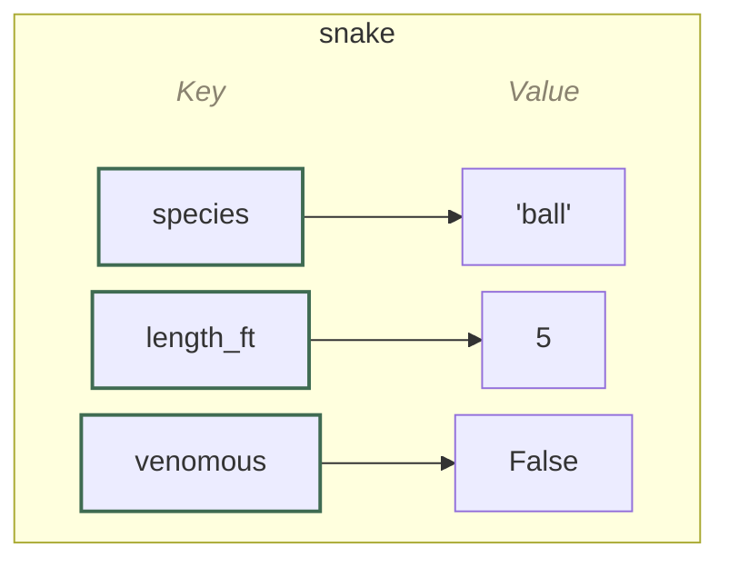

```mermaid
block-beta
  block:diagram
    columns 5
    lblValue["Value"] v0["&quot;burmese&quot;"] v1["&quot;rock&quot;"] v2["&quot;ball&quot;"] v3["&quot;blood&quot;"]
    lblIndex["Index"] i0["0"] i1["1"] i2["2"] i3["3"]
    lblNeg["Negative index"] n0["-4"] n1["-3"] n2["-2"] n3["-1"]
  end

  classDef label fill:none,stroke:none,color:#8A8370
  classDef panel fill:#23221E,stroke:#35342E,stroke-width:1px
  class i0,i1,i2,i3,n0,n1,n2,n3,lblValue,lblIndex,lblNeg label
  class diagram panel
```

# :material-basket-outline:{ .lg .middle } Collection Data Types

A **collection** is a single object that groups multiple values (like [basic types](types.md)) together and so they can be stored in one variable together and worked with as a unit. 

<div class="pt-jump-table" markdown="block">

| Collection Type | Example | Access values by | Use it for |
|------|---------|:-----------------:|------------|
| <a href="#lists">**`list`**</a> | <pre><code class="language-python-ref">["ball", "burmese"]</code></pre> | position # | <ul><li>An ordered group of items you can freely add to, remove from, or reorder</li><li>Not sure? Start here — the default, general-purpose choice</li></ul> |
| <a href="#dictionaries">**`dictionary "dict"`**</a> | <pre><code class="language-python-ref">{&#10;  "species": "ball",&#10;  "length_ft": 5&#10;}</code></pre> | Name of a key | <ul><li>Values stored under names ("keys") instead of position, like `species`, `length_ft`</li><li>Use it to look values up by name</li><li>Can't have duplicate keys</li></ul> |
| <a href="#tuples">**`tuple`**</a> | <pre><code class="language-python-ref">("ball", "burmese")</code></pre> | position # | <ul><li>Like a list, but fixed — can't be changed once created</li><li>Values that should stay exactly as they are, like a coordinate pair</li></ul> |
| <a href="#sets">**`set`**</a> | <pre><code class="language-python-ref">{"ball", "burmese"}</code></pre> | Membership (`in`) | <ul><li>An unordered group where duplicates are automatically dropped</li><li>Use it for fast "is this in here?" checks</li></ul> |

</div>

??? tip "Check what type a variable is"

    `type()` shows the data type
    
    `isinstance()` checks whether a value is that type.

    ```python-ref
    weights = [5, 3, 6]

    type(weights)        # <class 'list'>

    isinstance(5, list)  # True
    isinstance(5, dict)  # False
    ```
    
## Lists

A list stores multiple items, in order, inside a single variable.

```python-ref
species = ["burmese", "rock", "ball", "blood"]
```



The **index** of the first item is 0[^zero-index], next is 1, and so on. 

The **negative index** starts counting down from the end instead, starting at `-1` for the last item, -2 for the second-to-last, and so on. Each item can be referenced by its positive or negative index.

### Access list items

- Index with `list[index]`.

    ```python-ref
    species[0]   # "burmese"
    species[-1]  # "blood"
    ```

- A **slice** `list[start:end]` returns a new list containing items from `start` index up to (but not including) the `end` index.

    ```python-ref
    species[1:3]  # ["rock", "ball"], starts at index 1, stops at (doesn't include) index 3
    ```

### Loop through a list

- The most common way to [loop](loops.md#loop-through-a-collection) is directly over the items. The loop runs once for every item in the list, and on each pass the loop variable, *(i.e. `specie`)* is set to the next item in the list. 

    ```python
    for specie in species: 
        print(specie)  # specie is "burmese", then "rock", then "ball", then "blood" — one item per pass
    ```

- If you also want the index of the item alongside the item itself, `enumerate()` hands back both together.

    ```python
    for index, specie in enumerate(species): 
        print(index, specie)  # 0 "burmese", then 1 "rock", then 2 "ball", then 3 "blood"
    ```

### List boolean expressions

- **`in`** checks whether a value exists in the list.

    ```python-ref
    "burmese" in species  # True
    ```

- **boolean expression:**

    - Truthy: a list with contents 
    
    - Falsy: an empty list `[]`

    ```python-ref
    if species:              # runs if the list has items
        print("found some")

    while species:           # loops until the list is empty
        species.pop()
    ```

### List operations

#### Inspect

- **`len()`** returns how many items are in a list.

    ```python-ref
    len(species)  # 4
    ```

- **`index()`** finds the position of the first match.

    ```python-ref
    species.index("burmese")  # 0
    ```

- **`count()`** counts how many times a value appears.

    ```python-ref
    species.count("ball")  # 1
    ```

#### Add item

- **`append()`** adds one item to the end of the list.

    ```python-ref
    species.append("carpet")  # ["burmese", "rock", "ball", "blood", "carpet"]
    ```

- **`insert()`** adds an item at a specific index, without overwriting what's already there.

    ```python-ref
    species.insert(1, "carpet")  # ["burmese", "carpet", "rock", "ball", "blood"]
    ```

- **`extend()`** adds every item from another iterable.

    ```python-ref
    species.extend(["carpet", "central african rock"])  # ["burmese", "rock", "ball", "blood", "carpet", "central african rock"]
    ```

#### Change item

- **`list[index] = value`** changes the item at that index.

    ```python-ref
    species[1] = "carpet"  # ["burmese", "carpet", "ball", "blood"]
    ```

- **`list[start:end] = value`** changes a whole range at once — the replacement doesn't need to be the same length.

    ```python-ref
    species[1:3] = ["carpet"]  # ["burmese", "carpet", "blood"]
    ```

#### Remove item

- **`remove()`** deletes the first item that matches a given value. If there are duplicate items, it only removes the first one. 

    ```python-ref
    species.remove("rock")  # ["burmese", "ball", "blood"]
    ```

- **`pop()`** deletes an item by index and returns it — with no index, it removes the last item.

    ```python-ref
    species.pop()   # "blood" (removed and returned last item)
    species.pop(0)  # "burmese" (removed and returned item at index 0)
    ```

- **`del`** removes an item by index, or can delete the entire list.

    ```python-ref
    del species[0]  # ["rock", "ball", "blood"]
    del species     # deletes the whole list — species no longer exists
    ```

- **`clear()`** empties the list but keeps the (now empty) list around.

    ```python-ref
    species.clear()  # []
    ```

#### Sort

- **`sort()`** sorts the list in place, alphabetically (or ascending, for numbers) by default. Pass `reverse=True` to sort in the opposite order, or a `key` function to control what each item is sorted by.

    ```python-ref
    species.sort()              # ["ball", "blood", "burmese", "rock"]
    species.sort(reverse=True)  # ["rock", "burmese", "blood", "ball"]
    species.sort(key=len)       # ["rock", "ball", "blood", "burmese"]
    ```

- **`sorted()`** does the same job as `sort()`, but returns a new list, leaving the original untouched.

    ```python-ref
    sorted(species)  # same as sort() above, but returns a new list
    ```

- **`reverse()`** flips the current order in place — different from `sort(reverse=True)`, since it doesn't actually sort, just reverses.

    ```python-ref
    species.reverse()  # ["blood", "ball", "rock", "burmese"]
    ```

#### Arithmetic

- **`min()`** finds the smallest item.

    ```python-ref
    min(length_ft)  # 3.5
    ```

- **`max()`** finds the largest item.

    ```python-ref
    max(length_ft)  # 12
    ```

- **`sum()`** adds every item together.

    ```python-ref
    sum(length_ft)  # 25
    ```

#### Create

- **`list()`** builds the same list from any iterable, if you'd rather not use literal brackets.

    ```python-ref
    list(("burmese", "rock", "ball", "blood"))  # ["burmese", "rock", "ball", "blood"]
    ```

- **`+`** joins two lists into a new one.

    ```python-ref
    species + ["carpet", "boa"]  # ["burmese", "rock", "ball", "blood", "carpet", "boa"]
    ```

- **`copy()`** makes a real, independent copy of the list — unlike `new_list = old_list`, which just points a second name at the same list, so a change through either name shows up in both.

    ```python-ref
    same_list = species      # same_list and species are the same list — changing one changes both
    backup = species.copy()  # backup is a separate, independent list
    ```

#### List comprehension

- **`[expr for item in iterable]`** builds a new list from an existing iterable in a single line. The expression part can transform each item, not just filter it.

    ```python-ref
    [s for s in species if len(s) > 4]  # ["burmese", "blood"]

    [s.title() for s in species]        # ["Burmese", "Rock", "Ball", "Blood"]
    ```

??? run "Practice with lists"
    Each box below is fully editable — write your answer, then click Run.

    **1. Access & check membership.** Print the second item in the list (index `1`), then check whether `"rock"` is in it.

    ```python
    species = ["indian", "carpet", "rock", "angolan", "blood"]

    # your code here
    ```

    **2. Change & add.** Change the first item to `"burmese"`, then add `"bornean"` to the end.

    ```python
    species = ["indian", "carpet", "rock", "angolan", "blood"]

    # your code here

    print(species)
    ```

    **3. Remove.** Remove `"carpet"` from the list, then pop the last item and print what was removed.

    ```python
    species = ["indian", "carpet", "rock", "angolan", "blood"]

    # your code here
    ```

    **4. List comprehension.** Build a list of just the names with more than 5 letters.

    ```python
    species = ["indian", "carpet", "rock", "angolan", "blood"]

    # your code here

    print(long_names)
    ```

    **5. Sort.** Sort the list in reverse alphabetical order.

    ```python
    species = ["indian", "carpet", "rock", "angolan", "blood"]

    # your code here

    print(species)
    ```

    ??? note "Show solutions"
        ```python
        # 1. Access & check membership
        species = ["indian", "carpet", "rock", "angolan", "blood"]
        print(species[1])
        print("rock" in species)
        ```
        ```python
        # 2. Change & add
        species = ["indian", "carpet", "rock", "angolan", "blood"]
        species[0] = "burmese"
        species.append("bornean")
        print(species)
        ```
        ```python
        # 3. Remove
        species = ["indian", "carpet", "rock", "angolan", "blood"]
        species.remove("carpet")
        last = species.pop()
        print(last)
        ```
        ```python
        # 4. List comprehension
        species = ["indian", "carpet", "rock", "angolan", "blood"]
        long_names = [s for s in species if len(s) > 5]
        print(long_names)
        ```
        ```python
        # 5. Sort
        species = ["indian", "carpet", "rock", "angolan", "blood"]
        species.sort(reverse=True)
        print(species)
        ```

## Dictionaries

A dictionary stores data as **key-value pair**, inside a single variable. There's no order/position to the keys. 

```python-ref
snake = {
    "species": "ball", 
    "length_ft": 5, 
    "venomous": False
    }
```



- Each **key** points to exactly one value. 

    - **A key's type** can be a string, int, float, or tuple

    - **No duplicate keys** — assigning a value to an existing key overwrites its value.

- A **value** can be any type.

### Access a value

- **`dict[key]`** accesses a value by key, in square brackets. This *will* raise an error if the key is not present, so best practice is to use the below get() instead. 

    ```python-ref
    snake["species"]  # "ball"
    ```

- **`get()`** does the same thing, but returns `None` if the key is not in the dict. You can provide an optinal default value to fall back on that will be returned if they key is not in the dict.

    ```python-ref
    snake.get("species")        # "ball"
    snake.get("weight_lbs", 0)  # 0 — key is missing, so the default is returned instead of None
    ```

### Loop through a dictionary

- Looping **directly** over a dictionary gives you its keys, one at a time — the loop runs once for every key in the dictionary, and on each pass the loop variable, *(i.e. `key`)* is set to the next key.

    ```python-ref
    for key in snake: 
        print(key)  # species  length_ft  venomous
    ```

- Loop over **`.values()`** to get just the values instead.

    ```python-ref
    for value in snake.values(): 
        print(value)              # ball  5  False
    ```

- Loop over **`.items()`** to get both the key and the value together.

    ```python-ref
    for key, value in snake.items(): 
        print(key, value)             # species ball  length_ft 5  venomous False
    ```

### Boolean expressions

- **`in`** checks whether a key exists at all.

    ```python-ref
    "species" in snake  # True
    ```

- **boolean expression:**

    - Truthy: a dictionary with at least one key

    - Falsy: an empty dictionary `{}`

    ```python-ref
    if snake:                    # runs if dictionary is not empty
        print("found a record")

    while snake:                 # loops until the dictionary is empty
        snake.popitem()
    ```

### Dictionary operations

#### Inspect

- **`len()`** returns how many key-value pairs are in a dictionary.

    ```python-ref
    len(snake)  # 3
    ```

#### Update

- **`dict[key] = value`** sets a key's value — changes it if the key already exists, adds it if not.

    ```python-ref
    snake["length_ft"] = 6           # {'species': 'ball', 'length_ft': 6, 'venomous': False}
    snake["origin"] = "west africa"  # {'species': 'ball', 'length_ft': 5, 'venomous': False, 'origin': 'west africa'}
    ```

- **`update()`** does the same for multiple keys at once — changes any that already exist, and adds any that don't.

    ```python-ref
    snake.update({"venomous": False, "docile": True})  # {'species': 'ball', 'length_ft': 5, 'venomous': False, 'docile': True}
    ```

#### Remove

- **`pop()`** removes a key and returns its value.

    ```python-ref
    snake.pop("venomous")  # False (removed and returned)
    ```

- **`popitem()`** removes and returns the last inserted key-value pair, as a tuple.

    ```python-ref
    snake.popitem()  # ('venomous', False) — removes the last inserted pair
    ```

- **`del`** removes a key-value pair by key.

    ```python-ref
    del snake["species"]  # {'length_ft': 5, 'venomous': False}
    ```

- **`clear()`** empties the dictionary but keeps the (now empty) dictionary around.

    ```python-ref
    snake.clear()  # {}
    ```

#### Create

- **`dict()`** builds the same dictionary using keyword arguments, if you'd rather not use literal braces.

    ```python-ref
    dict(species="ball", length_ft=5, venomous=False)  # {'species': 'ball', 'length_ft': 5, 'venomous': False}
    ```

- **`copy()`** makes a real, independent copy of the dictionary — unlike `new_dict = old_dict`, which just points a second name at the same dictionary, so a change to either would effect both.

    ```python-ref
    same_dict = snake      # same_dict and snake are the same dictionary — mutating one mutates both
    backup = snake.copy()  # backup is a separate, independent dictionary
    ```

??? note "Nested dictionaries"
    A dictionary's values can be other dictionaries. Useful for grouping related records under one variable, like a whole collection of snakes keyed by species. 
    
    Chain operations one after the other to reach a value nested inside an inner dictionary.

    ```python-ref
    snakes = {
        "ball": snake, 
        "burmese": {
            "length_ft": 16, 
            "venomous": False
            }
        }
    snakes["burmese"]["length_ft"]  # 16
    ```

??? run "Practice with dictionaries"
    Each box below is fully editable — write your answer, then click Run.

    **1. Add & change.** Add a `"docile"` key set to `True`, then change `"length_ft"` to `16`.

    ```python
    snake = {"species": "burmese", "length_ft": 12, "venomous": False}

    # your code here

    print(snake)
    ```

    **2. Remove.** Remove the `"venomous"` key from the dictionary.

    ```python
    snake = {"species": "burmese", "length_ft": 16, "venomous": False}

    # your code here

    print(snake)
    ```

    **3. Loop and collect.** Build a list of just the dictionary's values, using a loop (not `list(snake.values())`).

    ```python
    snake = {"species": "burmese", "length_ft": 16, "venomous": False}
    values = []

    # your code here

    print(values)
    ```

    **4. Nested access.** Given the dictionary below, print the ball python's length.

    ```python
    snakes = {
        "burmese": {"length_ft": 16, "venomous": False},
        "ball": {"length_ft": 5, "venomous": False},
    }

    # your code here
    ```

    ??? note "Show solutions"
        ```python
        # 1. Add & change
        snake = {"species": "burmese", "length_ft": 12, "venomous": False}
        snake["docile"] = True
        snake["length_ft"] = 16
        print(snake)
        ```
        ```python
        # 2. Remove
        snake = {"species": "burmese", "length_ft": 16, "venomous": False}
        del snake["venomous"]
        print(snake)
        ```
        ```python
        # 3. Loop and collect
        snake = {"species": "burmese", "length_ft": 16, "venomous": False}
        values = []
        for value in snake.values():
            values.append(value)
        print(values)
        ```
        ```python
        # 4. Nested access
        snakes = {
            "burmese": {"length_ft": 16, "venomous": False},
            "ball": {"length_ft": 5, "venomous": False},
        }
        print(snakes["ball"]["length_ft"])
        ```

## Tuples

A tuple stores multiple items, in order, written in parentheses. They are **immutable** so the items can't be changed once its created. 

```python-ref
species = ("burmese", "rock", "ball", "blood")
```


The **index** of the first item is 0[^zero-index], next is 1, and so on. 

The **negative index** starts counting down from the end instead, starting at `-1` for the last item, -2 for the second-to-last, and so on. Each item can be referenced by its positive or negative index.

### Access items

- Index with `tuple[index]`.

    ```python-ref
    species[0]   # "burmese"
    species[-1]  # "blood"
    ```

- A **slice** `tuple[start:end]` returns a new tuple containing items from `start` index up to (but not including) the `end` index.

    ```python-ref
    species[1:3]  # ("rock", "ball")
    ```

### Loop through a tuple

- The [loop](loops.md#loop-through-a-collection) runs once for every item in the tuple, and on each pass the loop variable, *(i.e. `specie`)* is set to the next item in the tuple.

    ```python-ref
    for specie in species: 
        print(specie)       # burmese  rock  ball  blood
    ```

- If you also want the index alongside the item, `enumerate()` hands back both together — works the same as on a list, since tuples support indexing too.

    ```python-ref
    for index, specie in enumerate(species): 
        print(index, specie)  # 0 "burmese", then 1 "rock", then 2 "ball", then 3 "blood"
    ```

### Boolean expressions

- **`in`** checks whether a value exists in the tuple.

    ```python-ref
    "rock" in species  # True
    ```

- **boolean expression:**

    - Truthy: a tuple with contents

    - Falsy: an empty tuple `()`

    ```python-ref
    if species:              # runs — species tuple has items
        print("found some")
    ```


### Packing and unpacking

- **Packing:** writing several values separated by commas, with or without the surrounding parentheses, implicitly builds a tuple.

    ```python-ref
    species = "burmese", "rock", "ball", "blood"  # parentheses optional — still a tuple
    type(species)                                 # <class 'tuple'>
    ```

- **Unpacking:** assigns each item in a tuple to its own variable in one line. The number of variables has to match the number of items.

    ```python-ref
    a, b, c, d = species  # a="burmese"  b="rock"  c="ball"  d="blood"
    ```

    A [`match` statement](conditionals.md#unpacking-a-tuple) can do this same unpacking while also branching on the tuple's shape or specific values.

    ```python-ref
    snake = (12, "ball")
    match snake:
        case (length, "ball"):                      # tuple with 2 items, where second is "ball"
            print(f"a {length} ft ball python")     # in this example, this case will run
        case (length, specie):                      # tuple with any 2 items
            print(f"a {length} ft {specie} python")
        case (length,):                             # tuple with any 1 item
            print(f"just a length: {length}")
        case _:                                     # 0 items, or tuple with more than 2 items
            print("invalid format")
    ```

### Tuple operations

#### Inspect

- **`len()`** returns how many items are in a tuple.

    ```python-ref
    len(species)  # 4
    ```

- **`count()`** counts how many times a value appears.

    ```python-ref
    species.count("burmese")  # 1
    ```

- **`index()`** finds the position of the first match.

    ```python-ref
    species.index("ball")  # 2
    ```

#### Arithmetic

- **`min()`** finds the smallest item.

    ```python-ref
    length_ft = (12, 4.5, 3.5, 5)
    min(length_ft)                 # 3.5
    ```

- **`max()`** finds the largest item.

    ```python-ref
    max(length_ft)  # 12
    ```

- **`sum()`** adds every item together.

    ```python-ref
    sum(length_ft)  # 25
    ```

#### Convert to modify

- **Convert to list -> edit -> convert back to tuple** builds a new tuple since a tuple can't be edited directly.

    ```python-ref
    species_list = list(species)   # convert tuple to a list
    species_list.append("carpet")  # edit it like any list
    species = tuple(species_list)  # convert back to tuple and reassign
    ```

#### Create

- **`tuple()`** builds the same tuple from any iterable, if you'd rather not use literal parentheses.

    ```python-ref
    tuple(["burmese", "rock", "ball", "blood"])  # ("burmese", "rock", "ball", "blood")
    ```

??? run "Practice with tuples"
    Each box below is fully editable — write your answer, then click Run.

    **1. Access & check membership.** Print the last item, then check whether `"carpet"` is in the tuple.

    ```python
    species = ("indian", "carpet", "rock", "blood")

    # your code here
    ```

    **2. Unpacking.** Unpack the tuple into four variables named `a`, `b`, `c`, `d`, then print them.

    ```python
    species = ("indian", "carpet", "rock", "blood")

    # your code here
    ```

    **3. Work around immutability.** Tuples can't be appended to directly — build a new tuple with `"angolan"` added to the end, using `+`.

    ```python
    species = ("indian", "carpet", "rock", "blood")

    # your code here

    print(species)
    ```

    ??? note "Show solutions"
        ```python
        # 1. Access & check membership
        species = ("indian", "carpet", "rock", "blood")
        print(species[-1])
        print("carpet" in species)
        ```
        ```python
        # 2. Unpacking
        species = ("indian", "carpet", "rock", "blood")
        a, b, c, d = species
        print(a, b, c, d)
        ```
        ```python
        # 3. Work around immutability
        species = ("indian", "carpet", "rock", "blood")
        species = species + ("angolan",)
        print(species)
        ```

## Sets

A set stores multiple items, in no particular order, inside a single variable — written with curly braces.

Because items have no fixed position, there's no indexing. Duplicates are irrelevant because adding a value that's already there changes nothing; a set can only ever hold each value once.

```python-ref
species = {"burmese", "rock", "ball", "blood"}  # order not fixed
```


### Loop through a set

The [loop](loops.md#loop-through-a-collection) runs once for every item in the set, in no guaranteed order, and on each pass the loop variable, *(i.e. `specie`)* is set to the next item.

```python-ref
for specie in species: 
    print(specie)       # burmese  rock  ball  blood — order not guaranteed
```

### Boolean expressions

- **`in`** checks whether a value exists — and does it far faster than a list or tuple, no matter how large the set gets, since Python looks it up directly instead of scanning item by item.

    ```python-ref
    "burmese" in species  # True
    ```

- **boolean expression:**

    - Truthy: a set with contents

    - Falsy: an empty set — written `set()`, not `{}`, since `{}` creates an empty dict instead

    ```python-ref
    if species:              # runs — the set has items
        print("found some")

    while species:           # loops until the set is empty
        species.pop()
    ```

### Set operations

#### Inspect

- **`len()`** returns how many items are in a set.

    ```python-ref
    len(species)  # 4
    ```

#### Arithmetic

- **`min()`** finds the smallest item.

    ```python-ref
    length_ft = {12, 4.5, 3.5, 5}
    min(length_ft)                 # 3.5
    ```

- **`max()`** finds the largest item.

    ```python-ref
    max(length_ft)  # 12
    ```

- **`sum()`** adds every item together.

    ```python-ref
    sum(length_ft)  # 25
    ```

#### Update

- **`add()`** adds a single item. Adding a value that's already present changes nothing.

    ```python-ref
    species.add("carpet")   # {"burmese", "rock", "ball", "blood", "carpet"}
    species.add("burmese")  # already there — no change
    ```

- **`update()`** adds every item from another iterable, one at a time.

    ```python-ref
    species.update(["carpet", "boa"])  # adds "boa"; "carpet" was already there
    ```

#### Remove

- **`remove()`** deletes an item, raising an error if it isn't there.

    ```python-ref
    species.remove("rock")  # errors if "rock" isn't in the set
    ```

- **`discard()`** does the same but stays silent if the item's missing.

    ```python-ref
    species.discard("rock")  # no error either way
    ```

- **`pop()`** removes and returns an arbitrary item, since there's no "last" item in an unordered collection.

    ```python-ref
    species.pop()  # removes and returns *some* item — which one isn't guaranteed
    ```

- **`clear()`** empties the set.

    ```python-ref
    species.clear()  # set()
    ```

#### Combine

Sets support the same operations as sets in math class — useful for comparing two groups directly instead of writing your own loop to do it.

```python-ref
constrictors = {"ball", "burmese", "boa"}
pet_friendly = {"ball", "burmese", "corn snake"}
```

- **`|`** union — everything in either set.

    ```python-ref
    constrictors | pet_friendly  # {"ball", "burmese", "boa", "corn snake"}
    ```

- **`&`** intersection — only what's in both.

    ```python-ref
    constrictors & pet_friendly  # {"ball", "burmese"}
    ```

- **`-`** difference — in the first set, but not the second.

    ```python-ref
    constrictors - pet_friendly  # {"boa"}
    ```

- **`^`** symmetric difference — in one set or the other, but not both.

    ```python-ref
    constrictors ^ pet_friendly  # {"boa", "corn snake"}
    ```

#### Compare

These check a relationship between two sets and hand back a `bool`, rather than building a new set the way [Combine](#combine) does.

- **`issubset()`** checks whether every item in this set is also in another set.

    ```python-ref
    {"ball", "burmese"}.issubset(constrictors)  # True
    ```

- **`issuperset()`** checks whether this set contains every item in another set — the reverse of `issubset()`.

    ```python-ref
    constrictors.issuperset({"ball"})  # True
    ```

- **`isdisjoint()`** checks whether two sets have no items in common.

    ```python-ref
    constrictors.isdisjoint({"cobra", "viper"})  # True
    ```

#### Create

- **`set()`** builds the same set from any iterable, if you'd rather not use literal braces.

    ```python-ref
    set(["burmese", "rock", "ball", "blood"])  # {'burmese', 'rock', 'ball', 'blood'}
    ```

- **`copy()`** makes a real, independent copy of the set — unlike `new_set = old_set`, which just points a second name at the same set, so a change through either name shows up in both.

    ```python-ref
    same_set = species       # same_set and species are the same set — mutating one mutates both
    backup = species.copy()  # backup is a separate, independent set
    ```

??? tip "Removing duplicates from a list"
    Converting a list to a set and back is a common one-line way to drop duplicates — though it also throws away the original order, unless you sort or otherwise re-derive it.

    ```python-ref
    species = ["ball", "burmese", "ball", "boa", "burmese"]
    list(set(species))  # ["burmese", "ball", "boa"] — order not guaranteed
    ```

??? run "Practice with sets"
    Each box below is fully editable — write your answer, then click Run.

    **1. Check membership & add.** Check whether `"carpet"` is in the set, then add it.

    ```python
    species = {"indian", "rock", "blood", "angolan"}

    # your code here
    ```

    **2. Remove.** Discard `"rock"` from the set — using the method that won't error even if it's already gone.

    ```python
    species = {"indian", "rock", "blood", "angolan"}

    # your code here

    print(species)
    ```

    **3. Deduplicate.** Given the list below (with repeats), build a set from it to remove duplicates, then convert it back to a list.

    ```python
    names = ["ball", "burmese", "ball", "boa", "burmese"]

    # your code here

    print(unique_names)
    ```

    ??? note "Show solutions"
        ```python
        # 1. Check membership & add
        species = {"indian", "rock", "blood", "angolan"}
        print("carpet" in species)
        species.add("carpet")
        ```
        ```python
        # 2. Remove
        species = {"indian", "rock", "blood", "angolan"}
        species.discard("rock")
        print(species)
        ```
        ```python
        # 3. Deduplicate
        names = ["ball", "burmese", "ball", "boa", "burmese"]
        unique_names = list(set(names))
        print(unique_names)
        ```

[^zero-index]: In programming, counting generally starts at 0, not 1. That's because an index isn't really a count of "how manyth" item something is — it's an *offset*, the number of steps from the start. The first item is 0 steps away, so it gets index `0`. It feels different from counting out loud ("first, second, third..."), but it's the convention nearly every programming language follows.
