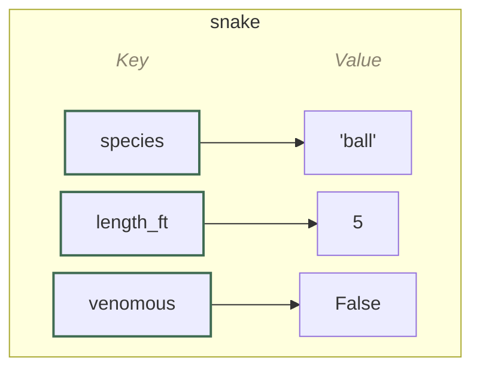

# :material-basket-outline:{ .lg .middle } Collection Data Types

A **collection** is a single object that groups multiple values together and stores them in one variable so they can be worked with together as a unit. 

The alternative is mainting multiple variables that each have one [basic types](types.md). 

<div class="pt-jump-table" markdown="block">

| Type | Example | Access values by | Use it for |
|------|---------|:-----------------:|------------|
| <a href="#lists">`list`</a> | <a href="#lists">`["ball", "burmese"]`</a> | <a href="#lists">Index (position)</a> | <a href="#lists"><ul><li>An ordered group of items you can freely add to, remove from, or reorder</li><li>Not sure? Start here — the default, general-purpose choice</li></ul></a> |
| <a href="#tuples">`tuple`</a> | <a href="#tuples">`("ball", "burmese")`</a> | <a href="#tuples">Index (position)</a> | <a href="#tuples"><ul><li>Like a list, but fixed — can't be changed once created</li><li>Values that should stay exactly as they are, like a coordinate pair</li></ul></a> |
| <a href="#dictionaries">`dict`</a> | <a href="#dictionaries">`{"species": "ball", "length_ft": 5}`</a> | <a href="#dictionaries">Key (so can't have duplicates)</a> | <a href="#dictionaries"><ul><li>Values stored under names ("keys") instead of position, like `species`, `length_ft`</li><li>Use it to look values up by name</li></ul></a> |
| <a href="#sets">`set`</a> | <a href="#sets">`{"ball", "burmese"}`</a> | <a href="#sets">Membership (`in`) only (so can't have duplicates)</a> | <a href="#sets"><ul><li>An unordered group where duplicates are automatically dropped</li><li>Use it for fast "is this in here?" checks</li></ul></a> |

</div>

??? tip "Use type() to check what a variable is"
    `type()` reports the exact collection type.

    ```python-ref
    species = ["burmese", "rock", "ball"]
    type(species)                           # <class 'list'>
    ```

## Lists

A list stores multiple items, in order, inside a single variable.

```python-ref
species = ["burmese", "rock", "ball", "blood"]
```

### Structured by index

```mermaid
block-beta
  block:diagram
    columns 5
    lblValue["Value"] v0["&quot;burmese&quot;"] v1["&quot;rock&quot;"] v2["&quot;ball&quot;"] v3["&quot;blood&quot;"]
    lblIndex["Index"] i0["0"] i1["1"] i2["2"] i3["3"]
    lblNeg["Negative index"] n0["-4"] n1["-3"] n2["-2"] n3["-1"]
  end

  classDef label fill:none,stroke:none,color:#8A8370
  classDef panel fill:#23221E,stroke:#35342E,stroke-width:1px
  class i0,i1,i2,i3,n0,n1,n2,n3,lblValue,lblIndex,lblNeg label
  class diagram panel
```



The **index** of the first item is 0[^zero-index], next is 1, and so on.

[^zero-index]: In programming, counting generally starts at 0, not 1. That's because an index isn't really a count of "how manyth" item something is — it's an *offset*, the number of steps from the start. The first item is 0 steps away, so it gets index `0`. It feels different from counting out loud ("first, second, third..."), but it's the convention nearly every programming language follows.

```python-ref
species[0]    # "burmese"
```

The **negative index** starts counting down from the end, starting at `-1` for the last item, -2 for the second-to-last, and so on. Each item can be referenced by it's positive or negative index.

```python-ref
species[-1]   # "blood"
```

A **slice** `list[start:end]` returns a new list containing items from `start` index up to (but not including) the `end` index.

```python-ref
species[1:3]  # ["rock", "ball"]
```

### Loop through a list

The most common way to loop is directly over the items.

```python
for s in species: 
    print(s) 
```

`enumerate()` gives you the index and the value together, if you need both. 

```python
for i, s in enumerate(species): 
    print(i, s)
```

### List operations

#### Inspect

- **`len()`** returns how many items are in a list.

    ```python-ref
    len(species)              # 4
    ```

- **`in`** checks whether a value exists in the list.

    ```python-ref
    "burmese" in species      # True
    ```

- **`index()`** finds the position of the first match.

    ```python-ref
    species.index("burmese")  # 0
    ```

- **`count()`** counts how many times a value appears.

    ```python-ref
    species.count("ball")     # 1
    ```

#### Change item

- **`list[index] = value`** changes the item at that index.

    ```python-ref
    species[1] = "carpet"      # ["burmese", "carpet", "ball", "blood"]
    ```

- **`list[start:end] = value`** changes a whole range at once — the replacement doesn't need to be the same length.

    ```python-ref
    species[1:3] = ["carpet"]  # ["burmese", "carpet", "blood"]
    ```

#### Add item

- **`append()`** adds one item to the end of the list.

    ```python-ref
    species.append("carpet")     # ["burmese", "rock", "ball", "blood", "carpet"]
    ```

- **`insert()`** adds an item at a specific index, without overwriting what's already there.

    ```python-ref
    species.insert(1, "carpet")  # ["burmese", "carpet", "rock", "ball", "blood"]
    ```

- **`extend()`** adds every item from another iterable.

    ```python-ref
    species.extend(["carpet", "central african rock"])  # ["burmese", "rock", "ball", "blood", "carpet", "central african rock"]
    ```

#### Remove item

- **`remove()`** deletes the first item that matches a given value.

    ```python-ref
    species.remove("rock")  # ["burmese", "ball", "blood"]
    ```

- **`pop()`** deletes an item by index and returns it — with no index, it removes the last item.

    ```python-ref
    species.pop()           # "blood" (removed and returned)
    species.pop(0)          # "burmese" (removed and returned)
    ```

- **`del`** removes an item by index, or can delete the entire list.

    ```python-ref
    del species[0]          # ["rock", "ball", "blood"]
    del species             # deletes the whole list — species no longer exists
    ```

- **`clear()`** empties the list but keeps the (now empty) list around.

    ```python-ref
    species.clear()         # []
    ```

#### Sort

- **`sort()`** sorts the list in place, alphabetically (or ascending, for numbers) by default. Pass `reverse=True` to sort in the opposite order, or a `key` function to control what each item is sorted by.

    ```python-ref
    species.sort()              # ["ball", "blood", "burmese", "rock"]
    species.sort(reverse=True)  # ["rock", "burmese", "blood", "ball"]
    species.sort(key=len)       # ["rock", "ball", "blood", "burmese"]
    ```

- **`sorted()`** does the same job as `sort()`, but returns a new list, leaving the original untouched.

    ```python-ref
    sorted(species)             # same as sort() above, but returns a new list
    ```

- **`reverse()`** flips the current order in place — different from `sort(reverse=True)`, since it doesn't actually sort, just reverses.

    ```python-ref
    species.reverse()           # ["blood", "ball", "rock", "burmese"]
    ```

#### Arithmetic

- **`min()`** finds the smallest item.

    ```python-ref
    min(length_ft)  # 3.5
    ```

- **`max()`** finds the largest item.

    ```python-ref
    max(length_ft)  # 12
    ```

- **`sum()`** adds every item together.

    ```python-ref
    sum(length_ft)  # 25
    ```

#### Create new list

- **`list()`** builds the same list from any iterable, if you'd rather not use literal brackets.

    ```python-ref
    list(("burmese", "rock", "ball", "blood"))  # ["burmese", "rock", "ball", "blood"]
    ```

#### Join two lists

- **`+`** joins two lists into a new one.

    ```python-ref
    species + ["carpet", "boa"]  # ["burmese", "rock", "ball", "blood", "carpet", "boa"]
    ```

#### Copy into new list

- **`copy()`** makes a real, independent copy of the list — unlike `new_list = old_list`, which just points a second name at the same list, so a change through either name shows up in both.

    ```python-ref
    same_list = species        # same_list and species are the same list — mutating one mutates both
    backup = species.copy()    # backup is a separate, independent list
    ```

??? tip "List comprehension"
    Builds a new list from an existing iterable in a single line. The expression part can transform each item, not just filter it.

    ```python-ref
    [s for s in species if len(s) > 4]    # ["burmese", "blood"]
    [s.title() for s in species]          # ["Burmese", "Rock", "Ball", "Blood"]
    ```

??? run "Run a list example"
    Each box below is fully editable — write your answer, then click Run.

    **1. Access & check membership.** Print the second item in the list (index `1`), then check whether `"rock"` is in it.

    ```python
    species = ["indian", "carpet", "rock", "angolan", "blood"]

    # your code here
    ```

    **2. Change & add.** Change the first item to `"burmese"`, then add `"bornean"` to the end.

    ```python
    species = ["indian", "carpet", "rock", "angolan", "blood"]

    # your code here

    print(species)
    ```

    **3. Remove.** Remove `"carpet"` from the list, then pop the last item and print what was removed.

    ```python
    species = ["indian", "carpet", "rock", "angolan", "blood"]

    # your code here
    ```

    **4. List comprehension.** Build a list of just the names with more than 5 letters.

    ```python
    species = ["indian", "carpet", "rock", "angolan", "blood"]

    # your code here

    print(long_names)
    ```

    **5. Sort.** Sort the list in reverse alphabetical order.

    ```python
    species = ["indian", "carpet", "rock", "angolan", "blood"]

    # your code here

    print(species)
    ```

    ??? note "Show solutions"
        ```python
        # 1. Access & check membership
        species = ["indian", "carpet", "rock", "angolan", "blood"]
        print(species[1])
        print("rock" in species)
        ```
        ```python
        # 2. Change & add
        species = ["indian", "carpet", "rock", "angolan", "blood"]
        species[0] = "burmese"
        species.append("bornean")
        print(species)
        ```
        ```python
        # 3. Remove
        species = ["indian", "carpet", "rock", "angolan", "blood"]
        species.remove("carpet")
        last = species.pop()
        print(last)
        ```
        ```python
        # 4. List comprehension
        species = ["indian", "carpet", "rock", "angolan", "blood"]
        long_names = [s for s in species if len(s) > 5]
        print(long_names)
        ```
        ```python
        # 5. Sort
        species = ["indian", "carpet", "rock", "angolan", "blood"]
        species.sort(reverse=True)
        print(species)
        ```

## Tuples

A tuple stores multiple items, in order, inside a single variable — written in parentheses.

Tuples are **Immutable** — it can't be changed once created, just overwritten with another tuple. 

```python-ref
species = ("burmese", "rock", "ball", "blood")
```

### Access items

Tuples use the same index and slice syntax as lists. `0` for the first item, negative indexes count from the end, `start:end` slices out a sub-tuple.


The **index** of the first item is 0[^zero-index], next is 1, and so on.

[^zero-index]: In programming, counting generally starts at 0, not 1. That's because an index isn't really a count of "how manyth" item something is — it's an *offset*, the number of steps from the start. The first item is 0 steps away, so it gets index `0`. It feels different from counting out loud ("first, second, third..."), but it's the convention nearly every programming language follows.

```python-ref
species[0]    # "burmese"
```

The **negative index** starts counting down from the end, starting at `-1` for the last item, -2 for the second-to-last, and so on. Each item can be referenced by it's positive or negative index.

```python-ref
species[-1]   # "blood"
```

A **slice** `tuple[start:end]` returns a new tuple containing items from `start` index up to (but not including) the `end` index.

```python-ref
species[1:3]  # ("rock", "ball")
```

### Unpacking

Assigns each item in a tuple to its own variable in one line. The number of variables has to match the number of items. A [`match` statement](conditionals.md#unpacking-a-tuple) can do this same unpacking while also branching on the tuple's shape or specific values.

```python-ref
a, b, c, d = species  # a="burmese"  b="rock"  c="ball"  d="blood"
```

### Loop tuples

Works exactly like looping over a list.

```python-ref
for s in species: 
    print(s)        # burmese  rock  ball  blood
```

### Tuple operations

#### Inspect

- **`in`** checks whether a value exists in the tuple.

    ```python-ref
    "rock" in species         # True
    ```

- **`count()`** counts how many times a value appears.

    ```python-ref
    species.count("burmese")  # 1
    ```

- **`index()`** finds the position of the first match — a tuple only has these three ways to inspect it, since it can't be changed.

    ```python-ref
    species.index("ball")     # 2
    ```

#### Join

- **`+`** builds a new tuple with an item added — there's no `append()` or `remove()`, since tuples can't be changed. Note the trailing comma in `("carpet",)`, needed to make it a one-item tuple rather than just parentheses around a string.

    ```python-ref
    species + ("carpet",)              # ("burmese", "rock", "ball", "blood", "carpet")
    ```

- **`tuple(list(...))`** round-trips through a list for bigger changes — convert to a list with `list()`, edit it normally, then convert back with `tuple()`.

    ```python-ref
    tuple(list(species) + ["carpet"])  # same result, via a list round-trip
    ```

#### Create

- **`tuple()`** builds the same tuple from any iterable, if you'd rather not use literal parentheses.

    ```python-ref
    tuple(["burmese", "rock", "ball", "blood"])  # ("burmese", "rock", "ball", "blood")
    ```

??? run "Run a tuple example"
    Each box below is fully editable — write your answer, then click Run.

    **1. Access & check membership.** Print the last item, then check whether `"carpet"` is in the tuple.

    ```python
    species = ("indian", "carpet", "rock", "blood")

    # your code here
    ```

    **2. Unpacking.** Unpack the tuple into four variables named `a`, `b`, `c`, `d`, then print them.

    ```python
    species = ("indian", "carpet", "rock", "blood")

    # your code here
    ```

    **3. Work around immutability.** Tuples can't be appended to directly — build a new tuple with `"angolan"` added to the end, using `+`.

    ```python
    species = ("indian", "carpet", "rock", "blood")

    # your code here

    print(species)
    ```

    ??? note "Show solutions"
        ```python
        # 1. Access & check membership
        species = ("indian", "carpet", "rock", "blood")
        print(species[-1])
        print("carpet" in species)
        ```
        ```python
        # 2. Unpacking
        species = ("indian", "carpet", "rock", "blood")
        a, b, c, d = species
        print(a, b, c, d)
        ```
        ```python
        # 3. Work around immutability
        species = ("indian", "carpet", "rock", "blood")
        species = species + ("angolan",)
        print(species)
        ```

## Dictionaries

A dictionary stores data as **key-value pairs**, inside a single variable.

A **key** can be any *immutable* type — a string, number, or tuple. **No duplicate keys** — assigning a value to an existing key overwrites its value.

A **value** can be any type.

```python-ref
snake = {
    "species": "ball", 
    "length_ft": 5, 
    "venomous": False
    }
```

### Structured by key



Each **key** points to exactly one value — that's what makes `dict[key]` a quick lookup instead of a scan through every item.

### Loop dictionaries

Looping directly over a dictionary gives you its keys, one at a time. 

```python-ref
for key in snake: 
    print(key)                    # species  length_ft  venomous
```

Loop over `.values()` to get just the values instead.

```python-ref
for value in snake.values(): 
    print(value)                  # ball  5  False
```

Loop over `.items()` to get both the key and the value together.

```python-ref
for key, value in snake.items(): 
    print(key, value)             # species ball  length_ft 5  venomous False
```

### Dictionary operations

#### Inspect

- **`dict[key]`** accesses a value by key, in square brackets — unlike a list, there's no numeric position to use.

    ```python-ref
    snake["species"]       # "ball"
    ```

- **`get()`** does the same thing, but returns `None` (or a default you choose) instead of raising an error if the key is missing.

    ```python-ref
    snake.get("venomous")  # False
    ```

- **`keys()`** returns a view object over the dictionary's keys.

    ```python-ref
    snake.keys()           # dict_keys(['species', 'length_ft', 'venomous'])
    ```

- **`values()`** returns a view object over the dictionary's values.

    ```python-ref
    snake.values()         # dict_values(['ball', 5, False])
    ```

- **`items()`** returns a view object over the dictionary's key-value pairs.

    ```python-ref
    snake.items()          # dict_items([('species', 'ball'), ('length_ft', 5), ('venomous', False)])
    ```

- **`in`** checks whether a key exists at all.

    ```python-ref
    "species" in snake    # True
    ```

#### Change / add

- **`dict[key] = value`** sets a key's value — changes it if the key already exists, adds it if not.

    ```python-ref
    snake["length_ft"] = 6           # {'species': 'ball', 'length_ft': 6, 'venomous': False}
    snake["origin"] = "west africa"  # {'species': 'ball', 'length_ft': 5, 'venomous': False, 'origin': 'west africa'}
    ```

- **`update()`** does the same for multiple keys at once — changes any that already exist, and adds any that don't.

    ```python-ref
    snake.update({"venomous": False, "docile": True})   # {'species': 'ball', 'length_ft': 5, 'venomous': False, 'docile': True}
    ```

#### Remove

- **`pop()`** removes a key and returns its value.

    ```python-ref
    snake.pop("venomous")  # False (removed and returned)
    ```

- **`popitem()`** removes and returns the last inserted key-value pair, as a tuple.

    ```python-ref
    snake.popitem()        # ('venomous', False) — removes the last inserted pair
    ```

- **`del`** removes a key-value pair by key.

    ```python-ref
    del snake["species"]   # {'length_ft': 5, 'venomous': False}
    ```

- **`clear()`** empties the dictionary but keeps the (now empty) dictionary around.

    ```python-ref
    snake.clear()          # {}
    ```

#### Copy

- **`copy()`** makes a real, independent copy of the dictionary — unlike `new_dict = old_dict`, which just points a second name at the same dictionary, so a change through either name shows up in both.

    ```python-ref
    same_dict = snake      # same_dict and snake are the same dictionary — mutating one mutates both
    backup = snake.copy()  # backup is a separate, independent dictionary
    ```

#### Create

- **`dict()`** builds the same dictionary using keyword arguments, if you'd rather not use literal braces.

    ```python-ref
    dict(species="ball", length_ft=5, venomous=False)  # {'species': 'ball', 'length_ft': 5, 'venomous': False}
    ```

??? note "Nested dictionaries"
    A dictionary's values can be other dictionaries. Useful for grouping related records under one variable, like a whole collection of snakes keyed by species. Chain square brackets to reach a value nested inside an inner dictionary.

    ```python-ref
    snakes = {"ball": snake, "burmese": {"length_ft": 16, "venomous": False}}
    snakes["burmese"]["length_ft"]                                              # 16
    ```

??? run "Run a dictionary example"
    Each box below is fully editable — write your answer, then click Run.

    **1. Add & change.** Add a `"docile"` key set to `True`, then change `"length_ft"` to `16`.

    ```python
    snake = {"species": "burmese", "length_ft": 12, "venomous": False}

    # your code here

    print(snake)
    ```

    **2. Remove.** Remove the `"venomous"` key from the dictionary.

    ```python
    snake = {"species": "burmese", "length_ft": 16, "venomous": False}

    # your code here

    print(snake)
    ```

    **3. Loop and collect.** Build a list of just the dictionary's values, using a loop (not `list(snake.values())`).

    ```python
    snake = {"species": "burmese", "length_ft": 16, "venomous": False}
    values = []

    # your code here

    print(values)
    ```

    **4. Nested access.** Given the dictionary below, print the ball python's length.

    ```python
    snakes = {
        "burmese": {"length_ft": 16, "venomous": False},
        "ball": {"length_ft": 5, "venomous": False},
    }

    # your code here
    ```

    ??? note "Show solutions"
        ```python
        # 1. Add & change
        snake = {"species": "burmese", "length_ft": 12, "venomous": False}
        snake["docile"] = True
        snake["length_ft"] = 16
        print(snake)
        ```
        ```python
        # 2. Remove
        snake = {"species": "burmese", "length_ft": 16, "venomous": False}
        del snake["venomous"]
        print(snake)
        ```
        ```python
        # 3. Loop and collect
        snake = {"species": "burmese", "length_ft": 16, "venomous": False}
        values = []
        for value in snake.values():
            values.append(value)
        print(values)
        ```
        ```python
        # 4. Nested access
        snakes = {
            "burmese": {"length_ft": 16, "venomous": False},
            "ball": {"length_ft": 5, "venomous": False},
        }
        print(snakes["ball"]["length_ft"])
        ```

## Sets

A set stores multiple items, in no particular order, inside a single variable — written with curly braces.

Because items have no fixed position, there's no indexing. Duplicates are irrelevant because adding a value that's already there changes nothing; a set can only ever hold each value once.

```python-ref
species = {"burmese", "rock", "ball", "blood"}  # order not fixed
```



```mermaid
block-beta
  block:diagram
    columns 5
    lblValue["Unordered set: "] v0["&quot;burmese&quot;"] v1["&quot;rock&quot;"] v2["&quot;ball&quot;"] v3["&quot;blood&quot;"]
  end

  classDef label fill:none,stroke:none,color:#8A8370
  classDef panel fill:#23221E,stroke:#35342E,stroke-width:1px
  class lblValue label
  class diagram panel
```

### Loop over a set

Works like looping over a list, just without any guaranteed order.

```python-ref
for s in species: 
    print(s)       # burmese  rock  ball  blood — order not guaranteed
```

### Set operations

#### Inspect

- **`in`** checks whether a value exists — and does it far faster than a list or tuple, no matter how large the set gets, since Python looks it up directly instead of scanning item by item.

    ```python-ref
    "burmese" in species  # True
    ```

#### Add

- **`add()`** adds a single item. Adding a value that's already present changes nothing.

    ```python-ref
    species.add("carpet")              # {"burmese", "rock", "ball", "blood", "carpet"}
    species.add("burmese")             # already there — no change
    ```

- **`update()`** adds every item from another iterable, one at a time.

    ```python-ref
    species.update(["carpet", "boa"])  # adds "boa"; "carpet" was already there
    ```

#### Remove

- **`remove()`** deletes an item, raising an error if it isn't there.

    ```python-ref
    species.remove("rock")   # errors if "rock" isn't in the set
    ```

- **`discard()`** does the same but stays silent if the item's missing.

    ```python-ref
    species.discard("rock")  # no error either way
    ```

- **`pop()`** removes and returns an arbitrary item, since there's no "last" item in an unordered collection.

    ```python-ref
    species.pop()            # removes and returns *some* item — which one isn't guaranteed
    ```

- **`clear()`** empties the set.

    ```python-ref
    species.clear()          # set()
    ```

#### Combine

Sets support the same operations as sets in math class — useful for comparing two groups directly instead of writing your own loop to do it.

```python-ref
constrictors = {"ball", "burmese", "boa"}
pet_friendly = {"ball", "burmese", "corn snake"}
```

- **`|`** union — everything in either set.

    ```python-ref
    constrictors | pet_friendly  # {"ball", "burmese", "boa", "corn snake"}
    ```

- **`&`** intersection — only what's in both.

    ```python-ref
    constrictors & pet_friendly  # {"ball", "burmese"}
    ```

- **`-`** difference — in the first set, but not the second.

    ```python-ref
    constrictors - pet_friendly  # {"boa"}
    ```

#### Create

- **`set()`** builds the same set from any iterable, if you'd rather not use literal braces.

    ```python-ref
    set(["burmese", "rock", "ball", "blood"])  # {'burmese', 'rock', 'ball', 'blood'}
    ```

??? tip "Removing duplicates from a list"
    Converting a list to a set and back is a common one-line way to drop duplicates — though it also throws away the original order, unless you sort or otherwise re-derive it.

    ```python-ref
    species = ["ball", "burmese", "ball", "boa", "burmese"]
    list(set(species))    # ["burmese", "ball", "boa"] — order not guaranteed
    ```

??? run "Run a set example"
    Each box below is fully editable — write your answer, then click Run.

    **1. Check membership & add.** Check whether `"carpet"` is in the set, then add it.

    ```python
    species = {"indian", "rock", "blood", "angolan"}

    # your code here
    ```

    **2. Remove.** Discard `"rock"` from the set — using the method that won't error even if it's already gone.

    ```python
    species = {"indian", "rock", "blood", "angolan"}

    # your code here

    print(species)
    ```

    **3. Deduplicate.** Given the list below (with repeats), build a set from it to remove duplicates, then convert it back to a list.

    ```python
    names = ["ball", "burmese", "ball", "boa", "burmese"]

    # your code here

    print(unique_names)
    ```

    ??? note "Show solutions"
        ```python
        # 1. Check membership & add
        species = {"indian", "rock", "blood", "angolan"}
        print("carpet" in species)
        species.add("carpet")
        ```
        ```python
        # 2. Remove
        species = {"indian", "rock", "blood", "angolan"}
        species.discard("rock")
        print(species)
        ```
        ```python
        # 3. Deduplicate
        names = ["ball", "burmese", "ball", "boa", "burmese"]
        unique_names = list(set(names))
        print(unique_names)
        ```
