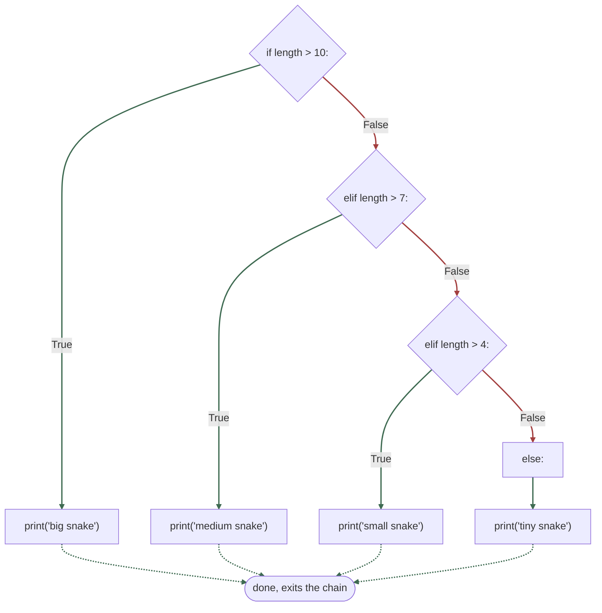
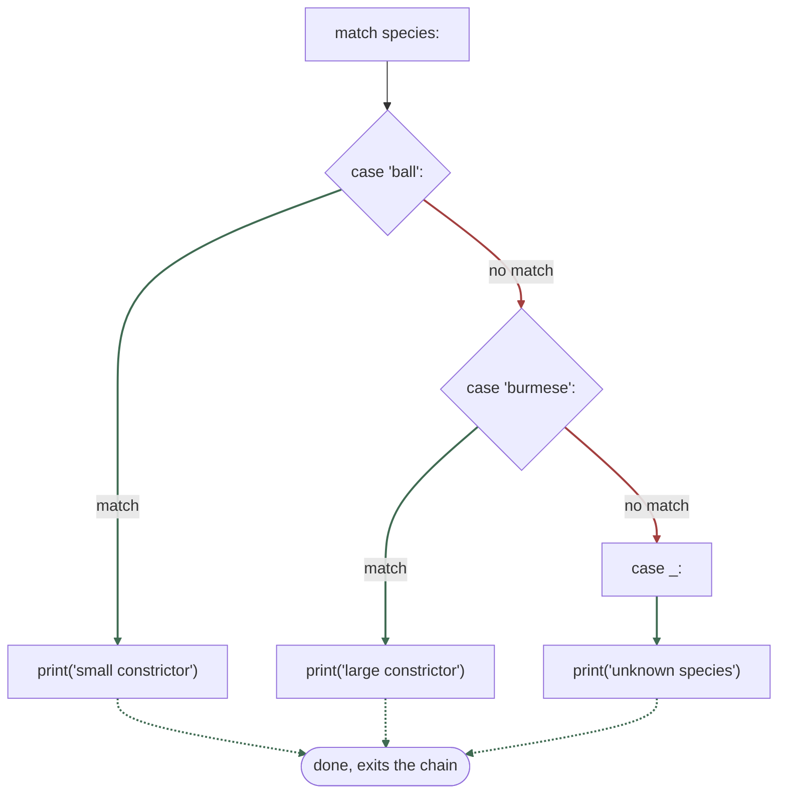

# Conditionals

A **conditional** lets a program make decisions by running a block of code only when a [condition](#boolean-expressions) is `True`. 

The condition ends with a colon `:`, and every line meant to run as part of that block must be indented underneath it.

| Statement              | Example                                                                                                                                                                       | When to use                                                          |
|------------------------|--------------------------------------------------------------------------------------------------------------------------------------------------------------------------------|-----------------------------------------------------------------------|
| `if` / `elif` / `else` | <pre><code class="language-python-ref">if length &gt; 15:&#10;    print("giant")&#10;elif length &gt; 8:&#10;    print("large")&#10;else:&#10;    print("small")</code></pre> | The general-purpose default — works for any condition, so use this unless `match` is clearly a better fit |
| `match` / `case`       | <pre><code class="language-python-ref">match species:&#10;    case "ball":&#10;        print("small")&#10;    case _:&#10;        print("other")</code></pre> | Comparing one value against several specific, known possibilities     |

## If / Elif / Else

A chain of `if`, `elif`, and `else` checks a series of conditions in order, running the indented block under the first one that's `True` — then exits the whole chain without checking any conditions below it. 

Only `if` is required; a chain can have any number of `elif`s (including none) and one optional `else`.

```python
length = 12

if length > 10:
    print("that's a big snake")
elif length > 7:
    print("that's a medium snake")
elif length > 4:
    print("that's a small snake")
else:
    print("that's a tiny snake")
```

<details markdown="block" class="pt-collapsible">
<summary markdown="block">

### See the Path
See the decision path the above code will take in the form of a flow chart diagram.
{: .pt-subheading }

</summary>



</details>

<details markdown="block" class="pt-collapsible">
<summary markdown="block">

### Boolean expressions

A boolean expression is needed for every `if`/`elif`.
{: .pt-subheading }

```python-ref
if [boolean expression]:
    [indented code block that runs if above expression is True]
elif [boolean expression]:
    [indented code block that runs if above expression is True and others above were False]
```

</summary>

A **boolean expression** is just a boolean value (`True` or `False`) or anything that produces one — like a comparison (`>`, `<`, `==`, and so on). This is what `if` checks: not the raw numbers or text themselves, but the `True`/`False` result of comparing them. Every `if` follows this same shape:

A comparison looks different depending on the type of value being checked, as shown below.

```python
length = 12
if length > 10:      # True — this runs
    print("long snake")

length = 5
if length > 10:      # False — this is skipped
    print("long snake")

# ints
length = 12
if length > 10:             # greater than
    print("long snake")

if length >= 12:            # greater than or equal to
    print("at least 12 ft")

if length != 0:             # not equal
    print("length was recorded")

# float comparison
weight_kg = 1.5
if weight_kg <= 2.0:           # less than or equal to
    print("2 kg or lighter")

# strings
name = "burmese python"
if name == "burmese python":   # string comparison
    print("it's a burmese")

if name != "ball python":      # string not-equal
    print("not a ball python")

if "python" in name:           # string substring check
    print("name contains 'python'")

# bool value
venomous = False
if not venomous:               
    print("safe to handle")

# None
age = None
if age is None:                # is None
    print("age not recorded")

if age is not None:            # is not None
    print("age was recorded")

# is it in a list
species = ["ball", "burmese", "boa"]
if "ball" in species:          # in
    print("ball python is in the list")

if "anaconda" not in species:  # not in
    print("anaconda isn't in the list")

# is it in a tuple
species_tuple = ("burmese", "rock", "ball", "blood")
if "ball" in species_tuple:     
    print("ball python is in the tuple")

# dict 
snake = {"species": "ball", "length": 3, "venomous": False}

if "venomous" in snake:         # is it a key in the dict
    print("snake dict tracks venomous status")

if "habitat" not in snake:      # dict key not-in
    print("snake dict has no habitat key")

if snake["length"] > 2:      # dict value comparison
    print("snake in dict is over 2 ft")
```

</details>

<details markdown="block" class="pt-collapsible">
<summary markdown="block">

### `elif`

Checks another condition, but only if the ones above it were False.
{: .pt-subheading }

```python-ref
length = 12
if length > 15:
    print("giant")
elif length > 8:
    print("large")     # runs — 12 > 8, and nothing below it gets checked
elif length > 4:
    print("medium")
else:
    print("small")
```

</summary>

`elif` ("else if") is checked only if every condition above it was `False`. Python runs the first branch whose condition is `True` and skips the rest, no matter how many `elif`s follow.

```python
length = 12
if length > 15:
    print("giant")
elif length > 8:
    print("large")
elif length > 4:
    print("medium")
else:
    print("small")

length = 3
if length > 15:
    print("giant")
elif length > 8:
    print("large")
elif length > 4:
    print("medium")
else:
    print("small")
```

</details>

<details markdown="block" class="pt-collapsible">
<summary markdown="block">

### `else`

The catch-all — it runs when nothing above it matched. It always comes last and doesn't have a condition.
{: .pt-subheading }

```python-ref
venomous = False
if venomous:
    print("handle with care")
else:
    print("safe to handle")    # runs — venomous is False
```

</summary>

`else` is the catch-all — it runs when nothing above it matched. It always comes last and never has a condition of its own. A conditional chain can have `elif` without `else`, but `else` (if present) must always be the final branch.

```python
venomous = False

if venomous:
    print("handle with care")
else:
    print("safe to handle")
```

</details>


<details markdown="block" class="pt-collapsible">
<summary markdown="block">

### Logical operators

Logical operators `not`, `and`, `or` let a single `if` combine boolean expressions to create more complex conditions.
{: .pt-subheading }

```python-ref
not venomous                  # not False → True

length > 10 and venomous   # True and False → False

length > 10 or venomous    # True or False → True
```

</summary>

[Boolean expressions](#a-boolean-expression-is-needed-for-every-ifelif) like the ones above can be combined with `and`, `or`, and `not`, so a single `if`/`elif` condition can check more than one thing at once.

| `A`                                       | `not A` — flips `A` to its opposite       |
|---------------------------------------------|----------------------------------------------|
| <span class="pt-bool-true">True</span>    | <span class="pt-bool-false">False</span> |
| <span class="pt-bool-false">False</span>  | <span class="pt-bool-true">True</span>   |

| `A`                                       | `B`                                       | `A and B` — `True` only if both are `True` | `A or B` — `True` if either is `True`     |
|----------------------------------------------|----------------------------------------------|----------------------------------------------|----------------------------------------------|
| <span class="pt-bool-true">True</span>    | <span class="pt-bool-true">True</span>    | <span class="pt-bool-true">True</span>    | <span class="pt-bool-true">True</span>    |
| <span class="pt-bool-true">True</span>    | <span class="pt-bool-false">False</span>  | <span class="pt-bool-false">False</span>  | <span class="pt-bool-true">True</span>    |
| <span class="pt-bool-false">False</span>  | <span class="pt-bool-true">True</span>    | <span class="pt-bool-false">False</span>  | <span class="pt-bool-true">True</span>    |
| <span class="pt-bool-false">False</span>  | <span class="pt-bool-false">False</span>  | <span class="pt-bool-false">False</span>  | <span class="pt-bool-false">False</span>  |


When several logical operators appear together, Python evaluates `not` first, then `and`, then `or`. Even when parentheses aren't required, they often make the condition much easier to read.

```python
length = 12
venomous = False

if length > 10 and venomous:
    print("big and dangerous")
if length > 10 or venomous:
    print("worth a closer look")
if not venomous:
    print("safe to handle")

if (length > 10 and not venomous) or length > 20:
    print("worth a closer look")
```

</details>

<details markdown="block" class="pt-collapsible">
<summary markdown="block">

### Nested `if`

Checks a second condition only after the first is `True`.
{: .pt-subheading }

```python-ref
length = 12
venomous = False
if length > 10:
    if venomous:
        print("big and dangerous")
    else:
        print("big but harmless")    # runs
```

</summary>

An `if` can contain another `if`, checked only once the outer condition is already `True` — Each level of nesting adds another decision. If both conditions are simple, combining them with [`and`](#logical-operators-not-and-or-let-a-single-if-check-more-than-one-condition) is usually clearer than nesting.

```python
length = 12
venomous = False

if length > 10:
    if venomous:
        print("big and dangerous")
    else:
        print("big but harmless")
```

</details>

<details markdown="block" class="pt-collapsible">
<summary markdown="block">

### One-line `if`

Simple checks and be written in one line.
{: .pt-subheading }

```python-ref
if venomous: print("careful")    # single-line if — the colon is still required
"careful" if venomous else "safe"    # "careful" — a compact if/else that evaluates to a value
```

</summary>

For a single statement, the body can go right on the same line as the condition. Save this for short, simple conditions — a normal multi-line `if` reads more clearly for anything more involved.

The `if`-`else` version is a single expression, not a statement — it evaluates to one value or the other, so it's most useful for a quick assignment or a function argument, not as a stand-in for a full `if` block. `value_if_true if condition else value_if_false` reads almost like the English sentence it describes.

```python
venomous = True
if venomous: print("careful")

status = "careful" if venomous else "safe"
print(status)
```

</details>

<details markdown="block" class="pt-collapsible">
<summary markdown="block">

### `pass` placeholder

Temporarily fill an empty block when you're not ready to write the inside code yet.
{: .pt-subheading }

```python-ref
if venomous:
    pass    # placeholder — does nothing, but keeps the block syntactically valid
```

</summary>

Python doesn't allow an empty block after a colon. `pass` does nothing, but acts as a placeholder until you're ready to add code.

```python
venomous = True

if venomous:
    pass

print("checked venomous status, no action taken yet")
```

</details>

## Match / Case

A `match` statement compares one value against several `case` options and runs the code for the first matching `case`.

Both examples below do the same thing, but `match` is often easier to read than a long `if/elif` sequence when checking one value against many possibilities.

```python
species = "ball"

# if/elif chain
if species == "ball":
    print("small constrictor")
elif species == "burmese":
    print("large constrictor")
else:
    print("unknown species")

# the same logic as a match statement
match species:
    case "ball":
        print("small constrictor")
    case "burmese":
        print("large constrictor")
    case _:
        print("unknown species")
```

<details markdown="block" class="pt-collapsible">
<summary markdown="block">

### See the Path
See the decision path the above code will take in the form of a flow chart diagram.
{: .pt-subheading }

</summary>



<details markdown="block" class="pt-collapsible">
<summary markdown="block">

### Match multiple values `|`

Lets one `case` match several possible values, so you don't need a separate `case` for each one.
{: .pt-subheading }

```python-ref
match species:
    case "ball" | "corn":
        print("small species")     # runs — species is "ball"
    case _:
        print("other")
```

</summary>

`|` lets one `case` match several possible values, so you don't need a separate `case` for each one.

```python
species = "ball"

match species:
    case "ball" | "corn":
        print("small species")
    case _:
        print("other")
```

</details>

<details markdown="block" class="pt-collapsible">
<summary markdown="block">

### Default `_` 
Runs a block of code if no `case` matched, like an `else` in an `if` statement. 
{: .pt-subheading }

```python-ref
match species:
    case "anaconda":
        print("giant")
    case _:
        print("not an anaconda")   # runs — no other case matched
```

</summary>

`_` matches anything, so it's usually placed last to catch every value that wasn't matched earlier. It works much like `else` in an `if` statement. Without it, a value matching no `case` would run nothing.

```python
species = "ball"

match species:
    case "anaconda":
        print("giant")
    case _:
        print("not an anaconda")
```

</details>

<details markdown="block" class="pt-collapsible">
<summary markdown="block">

### Adding an `if` to a `case` only runs it when a second condition is also `True`

```python-ref
length = 12
match length:
    case n if n > 10:
        print("big")              # runs — 12 > 10
    case n:
        print("small")
```

</summary>

A `case` can store the matched value in a variable (here `n`) and add an `if` condition. That branch only runs if both the value matches and the `if` condition is `True`.

```python
length = 12

match length:
    case n if n > 10:
        print("big")
    case n:
        print("small")
```

</details>
