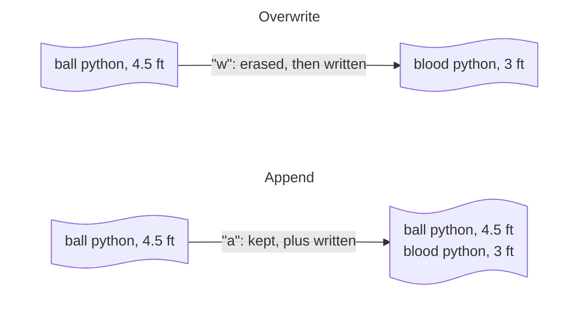

# :material-file-document-outline:{ .lg .middle } File I/O

A file lets a program keep data around after it ends — `print()` shows something on screen, but it's gone the moment the program stops. Saving to a file means that data is still there the next time it runs.

**I/O** stands for **input/output** — the general term for a program reading data in or sending data out, to somewhere other than just the screen. `print()` and `input()`, already covered on the [Foundations](foundations.md#print-function) page, are technically I/O too — output to the terminal, input from the keyboard. "File I/O" narrows that down to reading from and writing to files on disk specifically.


## Opening a file

`open()` returns a file object to read from or write to. Wrap it in a `with` block so it's closed automatically once you're done, even if something goes wrong partway through.

```python-ref
with open("notes.txt", "w") as file:
    file.write("ball python, 4.5 ft")

print("saved")
```

The second argument is the **mode** — what you intend to do with the file:

| Mode | Meaning |
|------|---------|
| `"r"` | Read (default) — the file must already exist |
| `"w"` | Write — creates the file if it doesn't exist, erases its contents if it does |
| `"a"` | Append — creates the file if it doesn't exist, adds to the end if it does |

??? warning "Without `with`, you have to call `file.close()` yourself"
    `with` closes the file automatically once its block ends — even if the code inside raises an error. Without it, you have to call `file.close()` yourself, and forgetting to means your writes might never actually reach the file (still sitting in a buffer), or the **file stays locked** for anything else trying to open it.

    ```python-ref
    file = open("notes.txt", "w")
    file.write("ball python, 4.5 ft")
    file.close()          # easy to forget
    ```

??? run "Run an opening a file example"
    All the examples above, combined into one script:

    ```python
    with open("notes.txt", "w") as file:
        file.write("ball python, 4.5 ft")

    print("saved")
    ```

## Reading a file

Say `notes.txt` already exists — written by an earlier run, or typed by hand in a text editor — and looks like this, one snake per line:

```text
ball python, 4.5 ft
burmese python, 12 ft
boa, 8 ft
```

`.read()` returns the whole thing as one string, newlines and all.

```python-ref
with open("notes.txt", "w") as file:
    file.write("ball python, 4.5 ft\nburmese python, 12 ft\nboa, 8 ft\n")

with open("notes.txt", "r") as file:
    text = file.read()

print(text)
```

`.readlines()` instead returns a list, one string per line, each still ending in a trailing `\n`. Looping over the file object directly reads it the same way, one line at a time, without holding the whole list in memory at once.

```python-ref
with open("notes.txt", "r") as file:
    lines = file.readlines()
print(lines)    # ["ball python, 4.5 ft\n", "burmese python, 12 ft\n", "boa, 8 ft\n"]

with open("notes.txt", "r") as file:
    for line in file:
        print(line.strip())    # ball python, 4.5 ft / burmese python, 12 ft / boa, 8 ft
```

??? run "Run a reading a file example"
    All the examples above, combined into one script:

    ```python
    with open("notes.txt", "w") as file:
        file.write("ball python, 4.5 ft\nburmese python, 12 ft\nboa, 8 ft\n")

    with open("notes.txt", "r") as file:
        text = file.read()

    print(text)

    with open("notes.txt", "r") as file:
        lines = file.readlines()
    print(lines)

    with open("notes.txt", "r") as file:
        for line in file:
            print(line.strip())
    ```

## Writing multiple lines

`.write()` doesn't add a newline for you — add one yourself at the end of each line, usually by looping over a list.

```python-ref
species = ["ball python", "burmese python", "boa"]

with open("notes.txt", "w") as file:
    for s in species:
        file.write(s + "\n")
```

??? run "Run a writing multiple lines example"
    All the examples above, combined into one script:

    ```python
    species = ["ball python", "burmese python", "boa"]

    with open("notes.txt", "w") as file:
        for s in species:
            file.write(s + "\n")

    with open("notes.txt", "r") as file:
        print(file.read())
    ```

## Appending vs. overwriting

`"w"` erases whatever was already in the file before writing anything new — opening a file you meant to add to with `"w"` is a common way to accidentally lose data. Use `"a"` instead to add to the end, keeping the existing contents in place.



```python-ref
with open("notes.txt", "a") as file:
    file.write("blood python, 3 ft\n")

with open("notes.txt", "r") as file:
    print(file.read())
```

??? run "Run an appending vs. overwriting example"
    All the examples above, combined into one script:

    ```python
    with open("notes.txt", "w") as file:
        for s in ["ball python", "burmese python", "boa"]:
            file.write(s + "\n")

    with open("notes.txt", "a") as file:
        file.write("blood python, 3 ft\n")

    with open("notes.txt", "r") as file:
        print(file.read())
    ```

For reading and writing rows of structured, comma-separated data specifically, see the [csv](libraries/csv.md) page under Libraries — it's built on the same `open()` and file-mode basics covered here.
