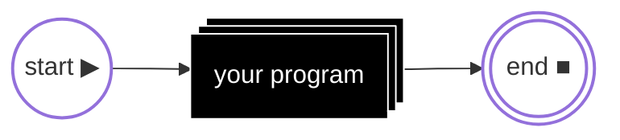
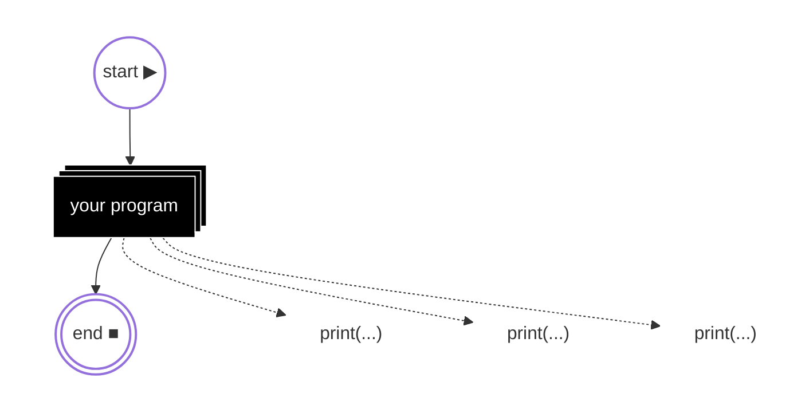
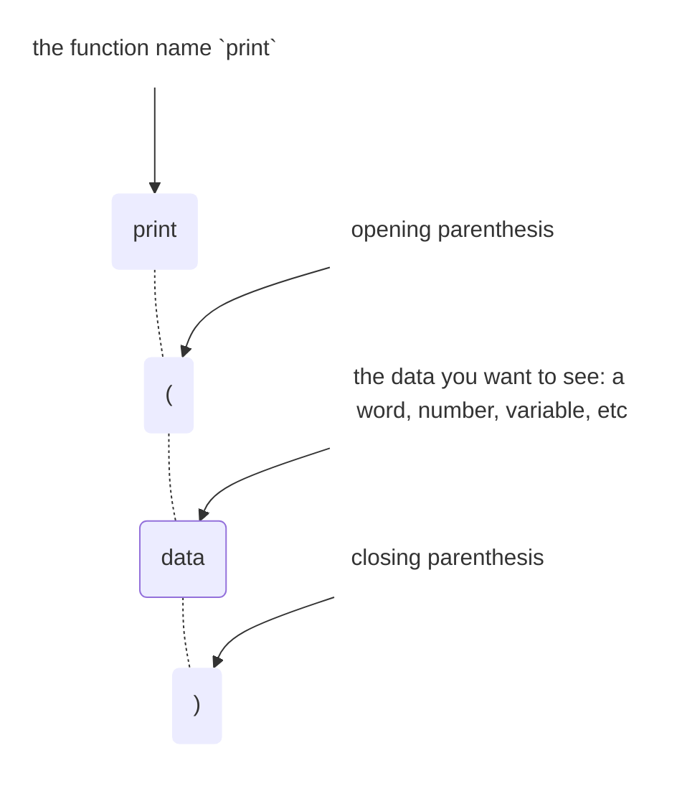
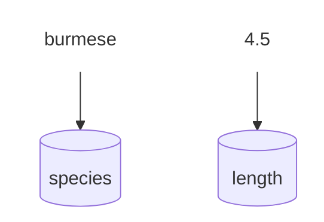
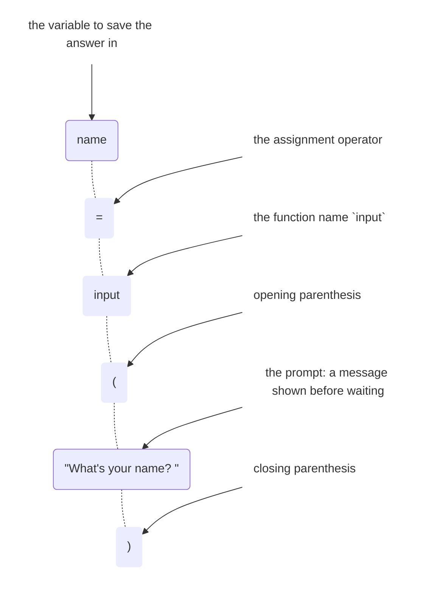

# :material-cube-outline:{ .lg .middle } Foundations

## Tips for getting started

- **[Setup](workspace.md) your workspace first** so you can run Python on your computer and edit Python files. 
- **Work through the pages in order.** 
- **Type the examples yourself**, and actually click **Run** on the runnable blocks and edit them — change a value, rerun, see what changes. That's where a concept actually sticks, not from reading it.
- **Errors are a normal, constant part of writing code, not a sign you did something wrong.** Once you hit your first one, the [Errors](errors.md) page — especially its [strategies for tracking one down](errors.md#debugging-strategies) — is worth reading properly rather than skimming.
    - [Read it out loud](errors.md#read-it-out-loud)
    - [Print debugging](errors.md#print-debugging)
    - [Isolate the problem](errors.md#isolate-the-problem)
- **Try building something small before you've finished the whole guide.** Once you've read through [Conditionals](conditionals.md) and [Loops](loops.md) you already have enough to write a program. 
- The homepage [FAQ](index.md#faq) has more on using AI to help you learn.

## Print function

### What do you see when a program runs? { data-card-link="skip" }

When a Python program is running, it won't show you anything on its own — it runs silently.

That's a problem for you as the developer — without some way to look inside, you can't follow along with what it's actually doing as it runs. 



`print()` solves that: it's a line of code you can add at checkpoints throughout your program, that displays a value so you can see what's happening as your program runs.



Code editors have an **output** window at the bottom that shows the print statements as the program runs.

### Structure of a print() statement { data-card-link="skip" }

`print` is a [function](functions.md) — a named, reusable piece of code that does something when you "call" it by name. These building blocks are all you need to use `print()`:



```python-ref
print("hello, field guide")   # when printing words, add quotes around them
print(4.5)                    # when printing a number, you do not need quotes
```

Most sections on this site end with a collapsed block like the one below — open it, click **Run**, and try editing the code and running it again.

??? run "Run a print() example"
    All the examples above, combined into one script:

    ```python
    print("hello, field guide")
    print(4.5)
    ```

## Variables

### How do variables work? { data-card-link="skip" }

A variable stores a value under a name so you can refer to that value again later instead of retyping it.

Think of a variable as a labeled bucket: the name (`species`) is the label, and the value (`burmese`) is whatever's currently inside. Pour in a new value later, and it replaces the old one — the bucket keeps its name, but not its contents.



Now you can reference the variable `species` and it will be equal to the value `burmese`.

Saving a new variable (we call this "assigning a variable") follows this format: 

`[variable name]` **`=`** `[value]`

### Naming variables

`snake_case` (lowercase words separated by underscores) is the standard format for variable names.

```python-ref
species_2 = "burmese python"    # valid
2nd_species = "burmese python"  # invalid — starts with a number
```

**Variable naming rules:**

1. **Only contains letters, underscores, and numbers** 

    Standard formatting is to use `snake_case` (all lowercase, separated with underscores). 

2. **Can't start with a number**

3. **Python is case-sensitive**

    Standard convention is that variables are always lower case. `Species` and `species` would be two different variables.

4. **Don't use a reserved keyword** 

    There are a handful of "keywords" that are reserved by Python to do specific things, so they can't be used elsewhere in your code. Run this code to get a list of all reserved keywords:

    ```python
    help("keywords")
    ```

5. **Don't use a library's name** 

    Naming a file `random.py` or `math.py` in a project makes `import random` elsewhere in that same project import your file instead of Python's actual `random` library, which is a confusing bug to track down. Run this code to get a list of all reserved library names:
    
    ```python
    help("modules")
    ```

### Reassigning a variable

You can update the value of an existing variable by setting it equal to something else.

```python-ref
species = "ball python"
species = "burmese python"    # replaces the old value entirely
```

??? tip "Assigning multiple variables with one line"
    Assign several variables in one line, or give them all the same value at once.

    ```python-ref
    species, length_ft = "ball python", 4.5
    a = b = 0
    ```

    `species, length_ft = "ball python", 4.5` assigns each value to the matching name in order — the same unpacking mechanism covered on the [Collections](collections.md#packing-and-unpacking) page. `a = b = 0` instead points every name at the *same* value, useful for initializing a few counters at once.

??? run "Run a variables example"
    All the examples above, combined into one script:

    ```python
    species_2 = "burmese python"
    print(species_2)

    Species = "ball python"
    species = "burmese python"
    print(Species)
    print(species)

    species = "ball python"
    print(species)

    species = "burmese python"
    print(species)

    species = 5
    print(species)

    species, length_ft = "ball python", 4.5
    print(species, length_ft)

    a = b = 0
    print(a, b)
    ```

### Printing variables { data-card-link="skip" }

**To print a single variable:**

Put the **variable name** inside the `print()` parentheses. It will print the **value** that the variable is equal to.

```python-ref
species = "burmese"
print(species)
```

**To print a variable and some words describing it:**

Add the words in quotes, then a comma, then the variable name. A comma adds a space there automatically, and works no matter what type the variable holds.

A `+` sign works too, but only when the variable is already a string — it doesn't add a space for you, and (unlike a comma) it can't join a string with a number, covered in [Building a string manually](#building-a-string-manually) below.

```python-ref
species = "burmese"
print("species:", species)
print("species:" + species)
```

**To print multiple things**

The simplest way to print several things on one line is to separate them with commas — Python adds a space between each one and converts numbers to text for you automatically.

```python-ref
species = "ball python"
length_ft = 4.5
print(species, length_ft, "ft")
```

Commas are usually the easier choice for a quick print. Pass `sep="..."` to change the default single-space separator, like `print(species, length_ft, sep=", ")`.

Once you're comfortable with the basics here, the [Collections](collections.md#list-operations) page covers printing the contents of a list or dict.

### Building a string manually { data-card-link="skip" }

Come back to this once you've read the [Types](types.md) page.

You can also build one string yourself with `+` and print that instead of using commas — but every piece has to already be a string, so a number like `length_ft` needs `str()` first, and you have to add the spaces yourself.

```python-ref
print(species + " " + str(length_ft) + " ft")    # ball python 4.5 ft — same output, more typing
```

For building a full sentence out of text and variables, an [f-string](types.md#f-strings) is usually clearer than either approach.

??? run "Run a printing variables example"
    All the examples above, combined into one script:

    ```python
    species = "burmese"
    print(species)

    print("species:", species)
    print("species:" + species)

    species = "ball python"
    length_ft = 4.5

    print(species, length_ft, "ft")
    print(species + " " + str(length_ft) + " ft")
    print(species, length_ft, sep=", ")
    ```

### Variables and types { data-card-link="skip" }

Come back to this once you've read the [Types](types.md) page.

A variable isn't locked to the type of value it first held — `species` can hold a string, then later be reassigned to an `int` or `float`, with no error.

```python-ref
species = "burmese python"    # str
species = 12                  # now an int — Python allows this
```

Other languages fix a variable to one type permanently at creation; Python doesn't. Every value still has its own type — [covered in full here](types.md) — a variable is just a name that can point at any of them, one at a time.

## Input function

`input()` allows the program to get typed input from the user

1. It prints a prompt to the user
2. It pauses and waits for the user to type something and press ++enter++
3. It does something with whatever they typed.

```python-ref
first_name = input("What's your first name? ")
print(first_name)
```

The text inside the parentheses — `"What's your first name? "` — is the **prompt**: a message shown before the program waits, so the person knows what to type.

### Structure of an input() statement { data-card-link="skip" }

`input` is a **function**, same as `print` — these are the same building blocks, just with a variable assignment at the beginning to save what the user inputs:



**Prompt format:**

Input prompts often have a `?` or `:` at the end. 

```python-ref
first_name = input("What's your first name? ")  # can use a ?
last_name = input("Enter your last name: ")     # or can use a :
```

They generally have an extra space before the last `"` — otherwise when the user starts typing their typing will be right up against the prompt with no gap, so it is harder to read. 

### Saving what the user types { data-card-link="skip" }

`input()` has to be assigned to a variable, or whatever was typed is thrown away — there's no other way to get back to it once the line finishes running.

```python-ref
input("What's your name? ")            # waits, then throws away whatever was typed
print("Hello!")                        # nothing to reference — it's gone

name = input("What's your name? ")     # saved to the variable name
print("Hello,", name)                  # now a usable variable
```

### Converting input to a number { data-card-link="skip" }

Come back to this once you've read the [Types](types.md) page.

Whatever the person types, `input()` always hands it back as a **string** — even a typed number comes back as text, not a real number.

To use what the user has entered as a real number, you must convert it with `int()` or `float()`, covered on the [Types](types.md#convert) page. Skipping this step causes an error the moment you try to do math with it — Python won't add a number to a string.

```python-ref
age = input("How old are you? ")          # "8" — a string, not the number 8
print(age + 1)                            # TypeError: can only concatenate str (not "int") to str

age = int(input("How old are you? "))     # 8 — now a real int
print(age + 1)                            # 9 — works fine
```

## Comments

### Single-line comments with \# { data-card-link="skip" }

A `#` marks the rest of a line as a comment — so Python ignores it. There are multiple reasons for this: 

1. **Annotate the code for yourself, explaining *why* or *how* it works.**

    ```python-ref
    species = "ball python"  # snake caught during the spring survey
    length_ft = 4.5
    # ball pythons rarely exceed 5 ft, so this value is worth double-checking
    print(species, length_ft)
    ```

    A comment that just restates the code in English (`# set length_ft to 4.5`) adds noise, not information — the code already says that. What's worth writing down is the reasoning the code itself can't show. 

    This also works in reverse: if you don't fully understand a piece of code yet — maybe you copied it from somewhere, or it's still new to you — leaving yourself a comment explaining it is genuinely useful.

2. **Temporarily disable code**

    Adding a `#` in front of a line stops it from running, without deleting it. Select multiple lines to comment out a whole block at once. 

    ```python-ref
    species = "ball python"
    # species = "burmese python"    # not running right now
    print(species)
    ```

    A few reasons to reach for it:

    - **Testing without deleting** — try a different value or approach, while keeping the original one line away in case you want it back.
    - **Isolating a bug** — comment out a chunk of code to check whether the rest still works, narrowing down where a problem actually is.
    - **Keeping old code as a reference** — a previous approach that worked but got replaced, left in place (usually with a note explaining why) in case it's useful again later.

    Commented-out code left too long tends to go stale and confuse whoever reads it later (including future you) — it's meant to be a temporary state, not a permanent way to store unused code.

    !!! tip "Keyboard shortcut for commenting/uncommenting multiple lines"
        | Action | Shortcut |
        |--------|------------------|
        | Comment / uncomment selected lines | ++cmd+slash++ (not IDLE)|
        | Select whole lines, one at a time | ++shift+down++ / ++shift+up++ |

3. **Flag unfinished work with `TODO` or `FIXME`**

    Marking a comment with `TODO` flags unfinished work, so you (or your editor) can find it again later.

    ```python-ref
    # TODO: handle the case where length_ft is negative
    length_ft = 4.5
    ```

    `TODO` is a word programmers agree to write in a comment to mean "come back to this." 

    `FIXME` is a common variant for flagging something that's actively broken, rather than just unfinished.

    Some editors can then collect every `TODO` in a project into one scannable list:

    - **PyCharm** has a built-in TODO tool window (**View → Tool Windows → TODO**, or ++alt+6++) that aggregates every `TODO`/`FIXME` in your project into a list.
    - **VS Code** needs an extension for this — [Todo Tree](https://marketplace.visualstudio.com/items?itemName=Gruntfuggly.todo-tree) is the most popular one, and adds a sidebar tree view of every tagged comment in your workspace.
    - **Thonny and IDLE** have no built-in equivalent — `TODO` still works as a plain comment, just without the aggregated list.

### Multi-line comments with """ { data-card-link="skip" }

A triple-quoted string on its own line acts like a comment spanning several lines.

```python-ref
"""
This whole block is ignored,
across as many lines as you want.
"""
species = "ball python"
```

Python doesn't have a true multi-line comment symbol — a triple-quoted string (`"""..."""` or `'''...'''`) is used as a stand-in instead.[^triple-quote-string]

[^triple-quote-string]: It isn't technically a comment — it's a string that Python creates and then immediately discards since nothing uses it. Python just never complains about a statement that does nothing, so the effect is the same as a real comment.

Placed as the very first line inside a function or a file specifically, this same trick is called a **docstring** and documents what that function or file does. Function docstrings are covered on the [Functions](functions.md#docstrings) page.

Placed as the very first line of a file instead, it becomes a **module docstring** — documenting the file as a whole rather than a single function, and a common place to note who wrote it and when.

```python-ref
"""
snake_survey.py

Tracks species and lengths recorded during the spring snake survey.

Author: Jordan Lee
Date: 2024-03-15
"""

species = "ball python"
length_ft = 4.5
```

More on docstring conventions on the [Style](style.md#docstrings) page.
