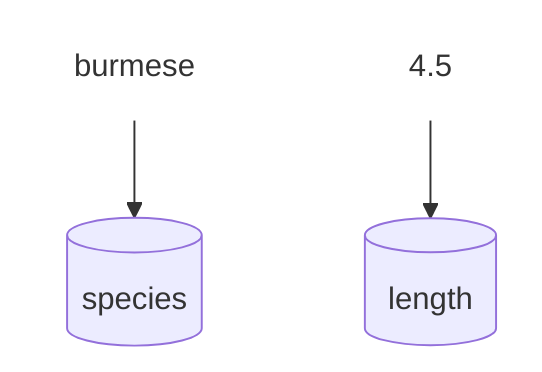

# Foundations

New to Python? Start here. Every code block on this site is runnable — click **Run** under the one below to see it work, then try editing it and running it again. 

This page covers three things you'll use in almost every program: displaying data with **`print()`**, storing a value in a **variable**, and leaving notes for yourself with **comments**.

## print()

`print()` displays a value on screen — it's the main way a Python program shows you anything while it runs, and the fastest way to check what a variable actually holds while you're writing or debugging code.

```python
print("hello, field guide")
print(4.5)
```

<details markdown="block" class="pt-collapsible">
<summary markdown="block">

### Printing multiple values

Pass several values separated by commas to print them on one line, space-separated.
{: .pt-subheading }

```python-ref
species = "ball python"
length_ft = 4.5
print(species, length_ft, "ft")    # ball python 4.5 ft
```

</summary>

`print()` joins the values with a single space by default — pass `sep="..."` to use something else instead, like `print(species, length_ft, sep=", ")`. For combining text and variables into one readable sentence, an [f-string](types.md#format-strings) is usually clearer than a long list of comma-separated pieces.

```python
species = "ball python"
length_ft = 4.5

print(species, length_ft, "ft")
print(species, length_ft, sep=", ")
```

</details>

Once you're comfortable with the basics here, the [Collections](collections.md#join-lists) page covers printing the contents of a list or dict.

## Variables

<details markdown="block" class="pt-collapsible">
<summary markdown="block">

### How do variables work?

A variable stores a value under a name so you can refer to that value again later instead of retyping it. 
{: .pt-subheading }

</summary>

Saving a new variable (we call this "assigning a variable") follows this format: 

`[variable name]` **`=`** `[value]`

```python
species = "burmese python"
length_ft = 4.5

print(species)
print(length_ft)
```

**Try it:** change `"burmese python"` to your own text, or `4.5` to a different number, then run it again — the output will update to match.

Think of a variable as a labeled bucket: the name (`species`) is the label, and the value ("burmese") is whatever's currently inside. Pour in a new value later, and it replaces the old one — the bucket keeps its name, but not its contents.


</details>

<details markdown="block" class="pt-collapsible">
<summary markdown="block">

### Naming variables

`snake_case` (lowercase words separated by underscores) is the standard format for variable names
{: .pt-subheading }

```python-ref
species_2 = "burmese python"    # valid
2nd_species = "burmese python"  # invalid — starts with a number
```

</summary>

**Variable naming rules:**

1. Can only contain letters, underscores, and numbers (but they can't *start* with a number)
2. Python is case-sensitive (`Species` and `species` are two different variables). 
2. Can't use reserved words: there are a handful of "keywords" that are reserved by Python to do specfic things, so they can't be used as variable names. 
!!! success "Valid"
    - `species`
    - `species_2`
    - `length_ft`
    - `_hidden`

!!! danger "Invalid"
    - `2nd_species` — starts with a number
    - `my-species` — hyphens aren't allowed
    - `class` — a reserved keyword
    - `my species` — spaces aren't allowed

```python
species_2 = "burmese python"
print(species_2)

Species = "ball python"
species = "burmese python"
print(Species)
print(species)

print("Run this code to see the reserved python keywords below:")
help("keywords")
```

</details>

<details markdown="block" class="pt-collapsible">
<summary markdown="block">

### Reassigning a variable

You can update the value of an existing variable by setting it equal to something else. 
{: .pt-subheading }

```python-ref
species = "ball python"
species = "burmese python"    # replaces the old value entirely
```

</summary>

Python doesn't lock a variable to the type it first held — `species` can hold a string, then later an `int`, with no error. This is different from languages that require declaring a variable's type up front.

```python
species = "ball python"
print(species)

species = "burmese python"
print(species)

species = 5
print(species)
```

</details>

<details markdown="block" class="pt-collapsible">
<summary markdown="block">

### Multiple assignment

Assign several variables in one line, or give them all the same value at once.
{: .pt-subheading }

```python-ref
species, length_ft = "ball python", 4.5
a = b = 0
```

</summary>

`species, length_ft = "ball python", 4.5` assigns each value to the matching name in order — the same unpacking mechanism covered on the [Collections](collections.md#unpacking) page. `a = b = 0` instead points every name at the *same* value, useful for initializing a few counters at once.

```python
species, length_ft = "ball python", 4.5
print(species, length_ft)

a = b = 0
print(a, b)
```

</details>

## Comments

A `#` marks the rest of a line as a **comment** — text Python ignores completely, meant for notes to yourself or anyone else reading the code.

```python
# this line does nothing when run
species = "ball python"  # neither does this part of the line
print(species)
```

<details markdown="block" class="pt-collapsible">
<summary markdown="block">

### Reason 1: leave a note

Explain the *why* the code is doing something, or explain a complicated part.
{: .pt-subheading }

```python-ref
length_ft = 4.5
# ball pythons rarely exceed 5 ft, so flag anything longer for double-checking
if length_ft > 5:
    print("unusually long — verify this measurement")
```

</summary>

A comment that just restates the code in English (`# set length_ft to 4.5`) adds noise, not information — the code already says that. What's worth writing down is the reasoning the code itself can't show: why `5` is the threshold, not just that a comparison is happening.

This also works in reverse: if you don't fully understand a piece of code yet — maybe you copied it from somewhere, or it's still new to you — leaving yourself a comment like `# not sure why this works, look into it later` is genuinely useful. It's an honest note for future you, and often marks exactly the spot worth coming back to once you know more.

```python
length_ft = 4.5

# ball pythons rarely exceed 5 ft, so flag anything longer for double-checking
if length_ft > 5:
    print("unusually long — verify this measurement")
else:
    print("looks typical")
```

</details>

<details markdown="block" class="pt-collapsible">
<summary markdown="block">

### Reason 2: temporarily disable code

"Commenting out code" by adding a `#` in front of the line will stops it from running without deleting it.
{: .pt-subheading }

```python-ref
species = "ball python"
# species = "burmese python"    # not running right now
print(species)
```

</summary>

This is different from writing a comment as a note — here the `#` is temporarily disabling real code. A few reasons to reach for it:

- **Testing without deleting** — try a different value or approach, while keeping the original one line away in case you want it back.
- **Isolating a bug** — comment out a chunk of code to check whether the rest still works, narrowing down where a problem actually is.
- **Keeping old code as a reference** — a previous approach that worked but got replaced, left in place (usually with a note explaining why) in case it's useful again later.

```python
species = "ball python"
# species = "burmese python"    # trying ball for now
length_ft = 4.5

print(species)

# old approach, replaced because it always rounded up:
# rounded = int(length_ft) + 1
rounded = round(length_ft)
print(rounded)
```

Commented-out code left too long tends to go stale and confuse whoever reads it later (including future you) — it's meant to be a temporary state, not a permanent way to store unused code.

</details>

<details markdown="block" class="pt-collapsible">
<summary markdown="block">

### Reason 3: flag unfinished work

Marking a comment with `TODO` flags unfinished work, so you (or your editor) can find it again later.
{: .pt-subheading }

```python-ref
# TODO: handle the case where length_ft is negative
length_ft = 4.5
```

</summary>

`TODO` is a word programmers agree to write in a comment to mean "come back to this." 

`FIXME` is a common variant for flagging something that's actively broken, rather than just unfinished.

Some editors can then collect every `TODO` in a project into one scannable list:

- **PyCharm** has a built-in TODO tool window (**View → Tool Windows → TODO**, or `Alt` + `6`) that aggregates every `TODO`/`FIXME` in your project into a list.
- **VS Code** needs an extension for this — [Todo Tree](https://marketplace.visualstudio.com/items?itemName=Gruntfuggly.todo-tree) is the most popular one, and adds a sidebar tree view of every tagged comment in your workspace.
- **Thonny and IDLE** have no built-in equivalent — `TODO` still works as a plain comment, just without the aggregated list.

```python
# TODO: reminding myself to come back and finish this part
length_ft = 4.5

# FIXME: reminding myself this part is broken
species = "ball python"

print(species, length_ft)
```

</details>

<details markdown="block" class="pt-collapsible">
<summary markdown="block">

### Multi-line comments

A triple-quoted string on its own line acts like a comment spanning several lines.
{: .pt-subheading }

```python-ref
"""
This whole block is ignored,
across as many lines as you want.
"""
species = "ball python"
```

</summary>

Python doesn't have a true multi-line comment symbol — putting `#` in front of every line is still the most common way to comment out a block. A triple-quoted string (`"""..."""` or `'''...'''`) isn't technically a comment, it's a string that Python creates and then immediately discards since nothing uses it — but it works the same way in practice, and is much faster to type for a longer note.

```python
"""
Notes on this file:
- lengths are approximate, measured nose to tail
- data collected during the spring survey
"""

species = "ball python"
length_ft = 4.5
print(species, length_ft)
```

One place this pattern *is* the real convention rather than a workaround: a triple-quoted string as the very first line inside a [function](functions.md) is called a **docstring**, and documents what that function does.

</details>

<details markdown="block" class="pt-collapsible">
<summary markdown="block">

### Keyboard shortcut for Commenting/uncommenting multiple lines

Select several lines, then comment all of them in one keystroke instead of line by line.
{: .pt-subheading }

</summary>

| Action | Shortcut |
|--------|------------------|
| Comment / uncomment selected lines | `Cmd` + `/` |
| Select whole lines, one at a time | `Shift` + `↓` / `↑` |

These are the defaults in VS Code, PyCharm, and Thonny. IDLE has no built-in shortcut for toggling comments on multiple lines at once. In every editor, the selection itself works the same way as selecting any text: click and drag, or hold `Shift` while using the arrow keys.

</details>
