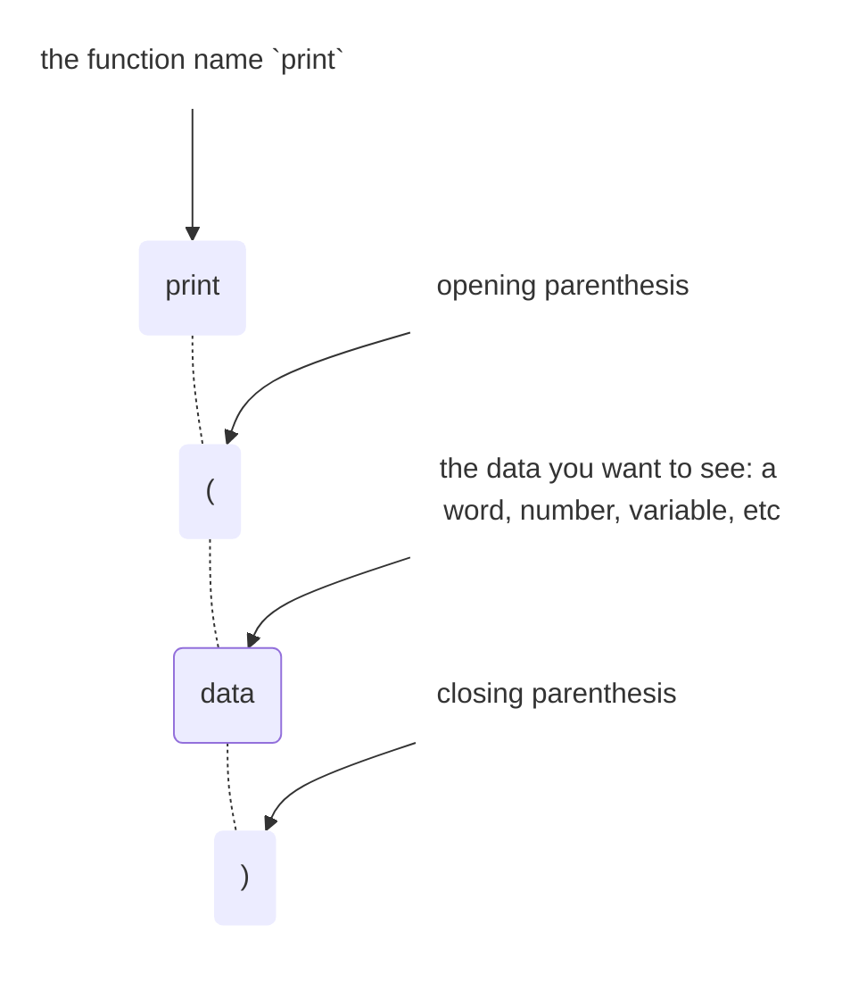
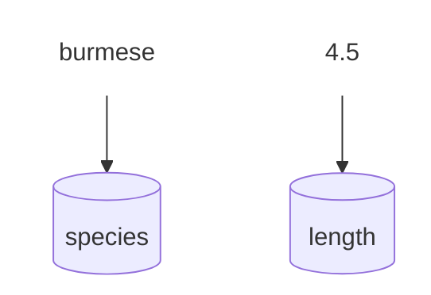

# :material-cube-outline:{ .lg .middle } Foundations

New to Python? Start here. Every code block on this site is runnable — click **Run** under it to see it work, then try editing it and running it again. 

## print()

When a program is running, it won't show you anything on its own — it just runs silently in the background.

That's a problem for you as the developer — without some way to look inside, you can't follow along with what it's actually doing as it runs. Once it starts, everything in between is a black box until it ends.


`print()` solves that: it displays a value while your program runs, so you can watch what's happening or check what a variable is currently equal to, right at the point it happens. Sprinkle a few print statements through your code, and instead of one opaque black box, you get a handful of checkpoints along the way.


Code editors have an **output** window at the bottom that displays all the print statements as the program runs.

`print` is a **function** — a named, reusable piece of code that does something when you "call" it by name. [Functions are covered more in depth here](functions.md), but you don't need to understand how they work yet. For now, these three building blocks are all you need to use `print()`:

- the word `print`
- a pair of parentheses `(` `)`. In programming, every open parenthesis `(` must have a corresponding closing one `)`.
- the value you want printed, placed between them



Put together, it looks like this:

```python-ref
print("hello, field guide")
print(4.5)
```

### Printing multiple values

The simplest way to print several things on one line is to separate them with commas — Python adds a space between each one and converts numbers to text for you automatically.

```python-ref
species = "ball python"
length_ft = 4.5
print(species, length_ft, "ft")    # ball python 4.5 ft
```

You can also build one string yourself with `+` and print that instead — but every piece has to already be a string, so a number like `length_ft` needs `str()` first, and you have to add the spaces yourself.

```python-ref
print(species + " " + str(length_ft) + " ft")    # ball python 4.5 ft — same output, more typing
```

Commas are usually the easier choice for a quick print. Pass `sep="..."` to change the default single-space separator, like `print(species, length_ft, sep=", ")`. For building a full sentence out of text and variables, an [f-string](types.md#format-strings) is usually clearer than either approach.

Once you're comfortable with the basics here, the [Collections](collections.md#join-lists) page covers printing the contents of a list or dict.

??? run "Run a print() example"
    All the examples above, combined into one script:

    ```python
    print("hello, field guide")
    print(4.5)

    species = "ball python"
    length_ft = 4.5

    print(species, length_ft, "ft")
    print(species + " " + str(length_ft) + " ft")
    print(species, length_ft, sep=", ")
    ```

## Variables

### How do variables work?

A variable stores a value under a name so you can refer to that value again later instead of retyping it.

Saving a new variable (we call this "assigning a variable") follows this format: 

`[variable name]` **`=`** `[value]`

**Try it:** change `"burmese python"` to your own text, or `4.5` to a different number, then run it again — the output will update to match.

Think of a variable as a labeled bucket: the name (`species`) is the label, and the value ("burmese") is whatever's currently inside. Pour in a new value later, and it replaces the old one — the bucket keeps its name, but not its contents.



### Naming variables

`snake_case` (lowercase words separated by underscores) is the standard format for variable names.

```python-ref
species_2 = "burmese python"    # valid
2nd_species = "burmese python"  # invalid — starts with a number
```

**Variable naming rules:**

1. Can only contain letters, underscores, and numbers (but they can't *start* with a number)
2. Python is case-sensitive (`Species` and `species` are two different variables). 
3. Can't use reserved words: there are a handful of "keywords" that are reserved by Python to do specific things, so they can't be used as variable names. 

!!! success "Valid"
    - `species`
    - `species_2`
    - `length_ft`
    - `_hidden`

!!! danger "Invalid"
    - `2nd_species` — starts with a number
    - `my-species` — hyphens aren't allowed
    - `class` — a reserved keyword
    - `my species` — spaces aren't allowed

### Reassigning a variable

You can update the value of an existing variable by setting it equal to something else.

```python-ref
species = "ball python"
species = "burmese python"    # replaces the old value entirely
```

Python doesn't lock a variable to the type it first held — `species` can hold a string, then later an `int`, with no error. This is different from languages that require declaring a variable's type up front.

??? tip "Multiple assignment"
    Assign several variables in one line, or give them all the same value at once.

    ```python-ref
    species, length_ft = "ball python", 4.5
    a = b = 0
    ```

    `species, length_ft = "ball python", 4.5` assigns each value to the matching name in order — the same unpacking mechanism covered on the [Collections](collections.md#unpacking) page. `a = b = 0` instead points every name at the *same* value, useful for initializing a few counters at once.

??? run "Run a variables example"
    All the examples above, combined into one script:

    ```python
    species_2 = "burmese python"
    print(species_2)

    Species = "ball python"
    species = "burmese python"
    print(Species)
    print(species)

    print("Run this code to see the reserved python keywords below:")
    help("keywords")

    species = "ball python"
    print(species)

    species = "burmese python"
    print(species)

    species = 5
    print(species)

    species, length_ft = "ball python", 4.5
    print(species, length_ft)

    a = b = 0
    print(a, b)
    ```

## input()

`print()` sends information out to the person running your program. `input()` does the opposite — it pauses your program, waits for the person to type something and press Enter, and hands back whatever they typed.

```python-ref
name = input("What's your name? ")
print("Hello,", name)
```

The text inside the parentheses — `"What's your name? "` — is the **prompt**: a message shown before the program waits, so the person knows what to type. It's optional; `input()` on its own just waits silently.

`input()` always returns a **string**, even if the person types a number. To use it as a real number, convert it first with `int()` or `float()`, covered on the [Types](types.md#convert-to-integer) page.

```python-ref
age = input("How old are you? ")          # "8" — a string, not the number 8
age = int(input("How old are you? "))     # 8 — now a real int
```

## Comments

A `#` marks the rest of a line as a **comment** — text Python ignores completely, meant for notes to yourself or anyone else reading the code.

```python-ref
# this line does nothing when run
species = "ball python"  # neither does this part of the line
print(species)
```

### Reason 1: leave a note

Explain the *why* the code is doing something, or explain a complicated part.

```python-ref
length_ft = 4.5
# ball pythons rarely exceed 5 ft, so flag anything longer for double-checking
if length_ft > 5:
    print("unusually long — verify this measurement")
```

A comment that just restates the code in English (`# set length_ft to 4.5`) adds noise, not information — the code already says that. What's worth writing down is the reasoning the code itself can't show: why `5` is the threshold, not just that a comparison is happening.

This also works in reverse: if you don't fully understand a piece of code yet — maybe you copied it from somewhere, or it's still new to you — leaving yourself a comment like `# not sure why this works, look into it later` is genuinely useful. It's an honest note for future you, and often marks exactly the spot worth coming back to once you know more.

??? tip "Reason 2: temporarily disable code"
    "Commenting out code" by adding a `#` in front of the line will stops it from running without deleting it.

    ```python-ref
    species = "ball python"
    # species = "burmese python"    # not running right now
    print(species)
    ```

    This is different from writing a comment as a note — here the `#` is temporarily disabling real code. A few reasons to reach for it:

    - **Testing without deleting** — try a different value or approach, while keeping the original one line away in case you want it back.
    - **Isolating a bug** — comment out a chunk of code to check whether the rest still works, narrowing down where a problem actually is.
    - **Keeping old code as a reference** — a previous approach that worked but got replaced, left in place (usually with a note explaining why) in case it's useful again later.

    Commented-out code left too long tends to go stale and confuse whoever reads it later (including future you) — it's meant to be a temporary state, not a permanent way to store unused code.

??? tip "Reason 3: flag unfinished work"
    Marking a comment with `TODO` flags unfinished work, so you (or your editor) can find it again later.

    ```python-ref
    # TODO: handle the case where length_ft is negative
    length_ft = 4.5
    ```

    `TODO` is a word programmers agree to write in a comment to mean "come back to this." 

    `FIXME` is a common variant for flagging something that's actively broken, rather than just unfinished.

    Some editors can then collect every `TODO` in a project into one scannable list:

    - **PyCharm** has a built-in TODO tool window (**View → Tool Windows → TODO**, or ++alt+6++) that aggregates every `TODO`/`FIXME` in your project into a list.
    - **VS Code** needs an extension for this — [Todo Tree](https://marketplace.visualstudio.com/items?itemName=Gruntfuggly.todo-tree) is the most popular one, and adds a sidebar tree view of every tagged comment in your workspace.
    - **Thonny and IDLE** have no built-in equivalent — `TODO` still works as a plain comment, just without the aggregated list.

### Multi-line comments

A triple-quoted string on its own line acts like a comment spanning several lines.

```python-ref
"""
This whole block is ignored,
across as many lines as you want.
"""
species = "ball python"
```

Python doesn't have a true multi-line comment symbol — putting `#` in front of every line is still the most common way to comment out a block. A triple-quoted string (`"""..."""` or `'''...'''`) isn't technically a comment, it's a string that Python creates and then immediately discards since nothing uses it — but it works the same way in practice, and is much faster to type for a longer note.

One place this pattern *is* the real convention rather than a workaround: a triple-quoted string as the very first line inside a [function](functions.md) is called a **docstring**, and documents what that function does.

??? tip "Keyboard shortcut for commenting/uncommenting multiple lines"
    Select several lines, then comment all of them in one keystroke instead of line by line.

    | Action | Shortcut |
    |--------|------------------|
    | Comment / uncomment selected lines | ++cmd+slash++ |
    | Select whole lines, one at a time | ++shift+down++ / ++shift+up++ |

    These are the defaults in VS Code, PyCharm, and Thonny. IDLE has no built-in shortcut for toggling comments on multiple lines at once. In every editor, the selection itself works the same way as selecting any text: click and drag, or hold ++shift++ while using the arrow keys.

??? run "Run a comments example"
    All the examples above, combined into one script:

    ```python
    # this line does nothing when run
    species = "ball python"  # neither does this part of the line
    print(species)

    length_ft = 4.5

    # ball pythons rarely exceed 5 ft, so flag anything longer for double-checking
    if length_ft > 5:
        print("unusually long — verify this measurement")
    else:
        print("looks typical")

    species = "ball python"
    # species = "burmese python"    # trying ball for now
    length_ft = 4.5

    print(species)

    # old approach, replaced because it always rounded up:
    # rounded = int(length_ft) + 1
    rounded = round(length_ft)
    print(rounded)

    # TODO: reminding myself to come back and finish this part
    length_ft = 4.5

    # FIXME: reminding myself this part is broken
    species = "ball python"

    print(species, length_ft)

    """
    Notes on this file:
    - lengths are approximate, measured nose to tail
    - data collected during the spring survey
    """

    species = "ball python"
    length_ft = 4.5
    print(species, length_ft)
    ```
