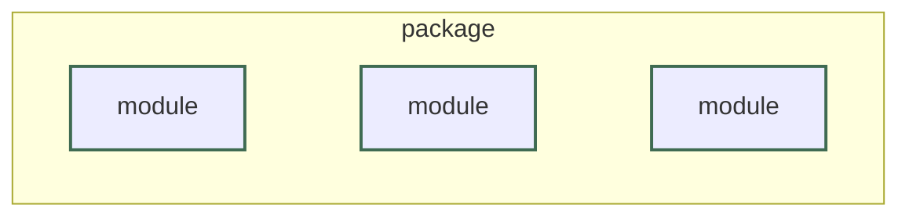
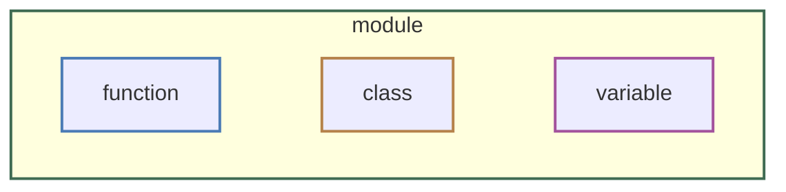
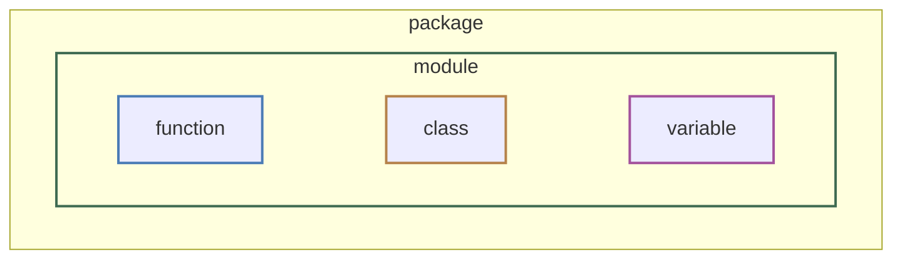

# :material-import:{ .lg .middle } Modules & Imports

## Modules vs packages vs libraries

A **module** is a Python file. Any `.py` file can be imported and used by another one. As a project grows, splitting related functions and classes into their own files, then importing between them, keeps any one file from becoming unmanageable.

A **package** is a folder of related modules grouped together so they can be imported as one unit.



**Library** is the informal umbrella term for either: a single module or a whole package — that's organized to be reused across projects. The [Libraries page](libraries/index.md) highlights a few common published libraries. 

## Importing modules

### import

`import` makes a module's code available under its own name, so you call things through it with a `.` — `random.randint(...)`, not just `randint(...)`.

```python-ref
import random

print(random.randint(1, 10))
```

### as

`as` gives the imported module a different name to call it by — handy for a long name you'd rather type shorter, or one that collides with something else in the file.

```python-ref
import random as rnd

print(rnd.randint(1, 10))
```

### from

**Specify a named piece that can be used directly:** Naming the exact names you need is considered best practice, as it purposefully only imports the pieces you are using. 

#### Packages

`from` package `import` module


```python-ref
from random import randint     # specify with module with from

print(randint(1, 10))
```

#### Modules

`from` module `import` function/class/variable



```python-ref
from snake_helpers import describe     # describe is a function inside snake_helpers.py

print(describe("ball"))
```

#### Nested paths

`from` package.module `import` function/class/variable



```python-ref
from os.path import join     # os is a package, path is one of its modules

print(join("snakes", "ball_python.txt"))
```

??? tip "Avoid `from module import *`"
    `*` is a wildcard standing in for "every name" — so `from module import *` pulls in every name from that module without saying which ones, so it's unclear later where a given name actually came from — `randint` on its own gives no hint it came from `random` rather than somewhere else in the file.

    This isn't the same as plain `import module`: `import module` only puts the module itself in scope, so everything inside it still needs the `.` prefix (`random.randint(...)`). `from module import *` instead dumps every name from inside the module directly into scope, unprefixed — that's what makes it both convenient and risky.

    ```python-ref
    from random import *
    randint(1, 10)    # works, but where did randint come from?
    ```

### order of multiple imports

Imports go at the very top of the file, grouped in order: Python's own standard library first, then third-party packages, then your own local files — with a blank line between each group.

```python-ref
import random                    # standard library

import requests                  # third-party — installed separately

import snake_data                # your own file
```

## Creating your own module

Your own `.py` files import the same way — use the filename, without `.py`, as the module name.

```python-ref
# snake_helpers.py

def describe(species):
    return f"a {species} python"
```

```python-ref
# main.py

import snake_helpers

print(snake_helpers.describe("ball"))
```

Avoid naming your own file after a library you use — your file named `random.py` shadows Python's own `random` module for anything else in that project. See the [file naming rules](workspace.md#step-2-write-and-run-a-python-file) for more.

### The main guard

`if __name__ == "__main__":` controls what runs only when a file is run directly — not when it's imported into another file.

```python-ref
def describe(species):
    return f"a {species} python"

if __name__ == "__main__":
    print(describe("ball"))
```

Wrapping your "do the actual work" code in this check means another file can `import` yours — to reuse a function, say — without that main code running too. 
