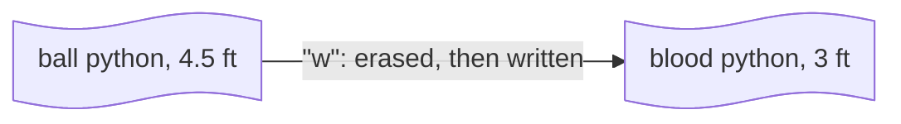
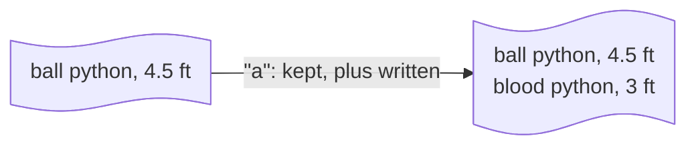

# :material-file-document-outline:{ .lg .middle } File Read/Write

<div class="pfg-section" markdown="block">

Instead of only printing output to the terminal, you can have the program save data to a file on your computer so data stays after the program ends, or read data from a file.

For how to pull code **from another `.py` file** into your program, that's in [Modules & Imports](modules.md#importing-modules).

<div class="pfg-diagram-frame" markdown="block">


<p class="pfg-diagram-caption">FIG: a program reading from and writing to a file</p>

</div>

</div>

<div class="pfg-section" markdown="block">

## Opening and closing files

`open()` returns a file object to read from or write to.

### File paths

`open("notes.txt", ...)` is a **relative path** — Python looks for `notes.txt` in the program's **working directory**, the folder it's currently running from, which isn't necessarily the folder the `.py` file itself lives in. Reaching a file somewhere else means either writing out the folders in between, or an **absolute path** — the full location starting from the filesystem's root, which works the same no matter what the working directory is.

Say `notes.txt` is inside a `snake_data` folder in your Documents folder instead of next to your script. To find its exact path:

=== "macOS"

    Right-click the file in Finder, hold ⌥ Option, and choose **Copy "notes.txt" as Pathname** — or drag the file straight into a Terminal window to have the path typed out for you.

    ```text
    /Users/luka/Documents/snake_data/notes.txt
    ```

=== "Windows"

    Shift+right-click the file in File Explorer and choose **Copy as path**.

    ```text
    C:\Users\luka\Documents\snake_data\notes.txt
    ```

That path is what goes inside `open()`:

```python-ref
with open("/Users/luka/Documents/snake_data/notes.txt", "r") as file:
    print(file.read())
```

On Windows, write the path with an `r` prefix (`r"C:\Users\luka\..."`) or doubled backslashes (`"C:\\Users\\luka\\..."`) — a single backslash inside a normal string starts an escape sequence, which isn't what a Windows path means.

Every runnable example on this page opens a plain filename like `"notes.txt"` — that's a relative path into the sandbox's own working directory, the same reason it works without ever specifying a folder.

### with

`with` runs the indented block below it, then closes the file automatically once the block ends — whether it finishes normally or raises an error partway through. `open(...)` produces the file object; `as file` is what makes it available under that name inside the block.

```python-ref
with open("notes.txt", "w") as file:
    file.write("ball python, 4.5 ft")

print("saved")                 # file is already closed here — "saved" sits outside the with block
```

Without `with`, the same thing takes an explicit `.close()` call — easy to forget, and skipping it means what you wrote might not be saved to the file yet — Python can hold new content in memory for a while before actually writing it out — or the file stays locked for anything else trying to open it.

```python-ref
file = open("notes.txt", "w")
file.write("ball python, 4.5 ft")
file.close()          # easy to forget
```

??? run "Run a with example"
    All the examples above, combined into one script:

    ```python
    with open("notes.txt", "w") as file:
        file.write("ball python, 4.5 ft")

    print("saved")
    ```

### Modes options

The second argument to `open()` is the **mode** — what you intend to do with the file:

| Mode | Meaning |
|------|---------|
| `"r"` | Read (default) — the file must already exist |
| `"w"` | Write — creates the file if it doesn't exist, erases its contents if it does |
| `"a"` | Append — creates the file if it doesn't exist, adds to the end if it does |
| `"x"` | Create — creates the file, but raises an error if it already exists |

</div>

<div class="pfg-section" markdown="block">

## Read

### Modes

#### "r" read existing

Say `notes.txt` already exists — written by an earlier run, or typed by hand in a text editor — and looks like this, one snake per line:

```text
ball python, 4.5 ft
burmese python, 12 ft
boa, 8 ft
```

Opening a file that doesn't exist in `"r"` mode raises `FileNotFoundError` instead of creating one — unlike `"w"`/`"a"`/`"x"`, `"r"` never creates a file.

```python-ref
with open("notes.txt", "r") as file:
    print(file.read())

open("missing.txt", "r")     # FileNotFoundError: [Errno 2] No such file or directory: 'missing.txt'
```

??? run "Run a read existing example"
    All the examples above, combined into one script:

    ```python
    with open("notes.txt", "w") as file:
        file.write("ball python, 4.5 ft\nburmese python, 12 ft\nboa, 8 ft\n")

    with open("notes.txt", "r") as file:
        print(file.read())

    try:
        open("missing.txt", "r")
    except FileNotFoundError as e:
        print(e)
    ```

### Functions

#### Whole file

`.read()` returns the whole thing as one string, newlines and all. It also takes an optional character count, returning just that many characters instead of the whole file.

```python-ref
with open("notes.txt", "w") as file:
    file.write("ball python, 4.5 ft\nburmese python, 12 ft\nboa, 8 ft\n")

with open("notes.txt", "r") as file:
    text = file.read()

print(text)

with open("notes.txt", "r") as file:
    print(file.read(4))    # "ball"
```

??? run "Run a whole file example"
    All the examples above, combined into one script:

    ```python
    with open("notes.txt", "w") as file:
        file.write("ball python, 4.5 ft\nburmese python, 12 ft\nboa, 8 ft\n")

    with open("notes.txt", "r") as file:
        text = file.read()

    print(text)

    with open("notes.txt", "r") as file:
        print(file.read(4))
    ```

#### By line

`.readlines()` returns a list, one string per line, each still ending in a trailing `\n`. Looping over the file object directly reads it the same way, one line at a time, without holding the whole list in memory at once. `.readline()` reads a single line and advances to the next — call it repeatedly to step through a file by hand, though looping does the same thing more naturally.

```python-ref
with open("notes.txt", "r") as file:
    lines = file.readlines()
print(lines)    # ["ball python, 4.5 ft\n", "burmese python, 12 ft\n", "boa, 8 ft\n"]

with open("notes.txt", "r") as file:
    for line in file:
        print(line.strip())    # ball python, 4.5 ft / burmese python, 12 ft / boa, 8 ft
```

??? run "Run a line-by-line example"
    All the examples above, combined into one script:

    ```python
    with open("notes.txt", "w") as file:
        file.write("ball python, 4.5 ft\nburmese python, 12 ft\nboa, 8 ft\n")

    with open("notes.txt", "r") as file:
        lines = file.readlines()
    print(lines)

    with open("notes.txt", "r") as file:
        for line in file:
            print(line.strip())
    ```

<div data-advanced="true" markdown="block">

??? efficiency "For efficiency, loop over a file instead of reading it all at once"
    | | Time | Space |
    |---|---|---|
    | `.read()` / `.readlines()` | <span class="pt-bigo pt-bigo--ok">O(n)</span> | <span class="pt-bigo pt-bigo--ok">O(n)</span> |
    | Loop over the file, line by line | <span class="pt-bigo pt-bigo--ok">O(n)</span> | <span class="pt-bigo pt-bigo--good">O(1)</span> |

    `.read()`/`.readlines()` holds the entire file's contents in memory at once (O(n) [space](../practices/style.md#time-and-space)). Looping over the file object or calling `.readline()` repeatedly needs only enough memory for the current line, O(1) space regardless of file size. 
    
    For a small file it doesn't matter; for a file too large to comfortably fit in memory, it's the difference between the program running and it not.

    See [Efficiency](../practices/style.md#efficiency) for why this distinction matters.

</div>

#### Seek and tell { data-advanced="true" }

`.tell()` returns the current position in the file, as a character count from the start. `.seek(position)` moves back to a given position, letting you re-read part of a file without closing and reopening it.

```python-ref
with open("notes.txt", "r") as file:
    file.read()
    print(file.tell())    # 52 — at the end, after reading everything

    file.seek(0)
    print(file.read(4))   # "ball" — back at the start
```

??? run "Run a seek and tell example"
    All the examples above, combined into one script:

    ```python
    with open("notes.txt", "w") as file:
        file.write("ball python, 4.5 ft\nburmese python, 12 ft\nboa, 8 ft\n")

    with open("notes.txt", "r") as file:
        file.read()
        print(file.tell())

        file.seek(0)
        print(file.read(4))
    ```

</div>

<div class="pfg-section" markdown="block">

## Write

### Modes

#### "w" overwrite

`"w"` erases whatever was already in the file before writing anything new — opening a file you meant to add to with `"w"` is a common way to accidentally lose data.

<div class="pfg-diagram-frame" markdown="block">



<p class="pfg-diagram-caption">FIG: "w" erases the file, then writes the new content</p>

</div>

```python-ref
species = ["ball python", "burmese python", "boa"]

with open("notes.txt", "w") as file:
    for s in species:
        file.write(s + "\n")
```

??? run "Run a writing multiple lines example"
    All the examples above, combined into one script:

    ```python
    species = ["ball python", "burmese python", "boa"]

    with open("notes.txt", "w") as file:
        for s in species:
            file.write(s + "\n")

    with open("notes.txt", "r") as file:
        print(file.read())
    ```

#### "a" append

Use `"a"` instead to add to the end, keeping the existing contents in place — compare against `"w"` above.

<div class="pfg-diagram-frame" markdown="block">



<p class="pfg-diagram-caption">FIG: "a" keeps the file's contents, then adds the new content to the end</p>

</div>

```python-ref
with open("notes.txt", "a") as file:
    file.write("blood python, 3 ft\n")

with open("notes.txt", "r") as file:
    print(file.read())
```

??? run "Run an appending vs. overwriting example"
    All the examples above, combined into one script:

    ```python
    with open("notes.txt", "w") as file:
        for s in ["ball python", "burmese python", "boa"]:
            file.write(s + "\n")

    with open("notes.txt", "a") as file:
        file.write("blood python, 3 ft\n")

    with open("notes.txt", "r") as file:
        print(file.read())
    ```

#### "x" create { data-advanced="true" }

`"x"` is for when overwriting an existing file would be a mistake — it creates the file, but raises `FileExistsError` instead of silently replacing something already there. Like `"w"`, it's write-only — reading from that same file object raises an error, so reading it back means reopening it in `"r"` mode afterward.

```python-ref
with open("newfile.txt", "x") as file:
    file.write("hello")

with open("newfile.txt", "r") as file:
    print(file.read())       # "hello"

open("newfile.txt", "x")     # FileExistsError: [Errno 17] File exists: 'newfile.txt'
```

??? run "Run an x mode example"
    All the examples above, combined into one script:

    ```python
    with open("newfile.txt", "x") as file:
        file.write("hello")

    with open("newfile.txt", "r") as file:
        print(file.read())

    try:
        with open("newfile.txt", "x") as file:
            file.write("hello again")
    except FileExistsError as e:
        print(e)
    ```

### Functions

#### Single string

`.write()` writes a string to the file — it doesn't add a newline for you, so add one yourself at the end of each line, usually by looping over a list. Whether that write starts the file fresh or adds onto what's already there depends on which mode you opened it with, `"w"` or `"a"`.

```python-ref
with open("notes.txt", "w") as file:
    file.write("ball python")
    file.write("4.5 ft")

with open("notes.txt", "r") as file:
    print(file.read())    # "ball python4.5 ft" — no newline between the two writes
```

??? run "Run a single string example"
    All the examples above, combined into one script:

    ```python
    with open("notes.txt", "w") as file:
        file.write("ball python")
        file.write("4.5 ft")

    with open("notes.txt", "r") as file:
        print(file.read())
    ```

#### Multiple strings

`.writelines()` takes a list of strings and writes them all in one call instead of looping yourself — like `.write()`, it doesn't add newlines, so they need to already be in the strings.

```python-ref
species = ["ball python\n", "burmese python\n", "boa\n"]

with open("notes.txt", "w") as file:
    file.writelines(species)
```

??? run "Run a writelines example"
    All the examples above, combined into one script:

    ```python
    species = ["ball python\n", "burmese python\n", "boa\n"]

    with open("notes.txt", "w") as file:
        file.writelines(species)

    with open("notes.txt", "r") as file:
        print(file.read())
    ```

</div>

<div class="pfg-section" markdown="block">

## Related libraries

Everything above is plain text. For other file formats, these Libraries pages build on the same `open()` and file-mode basics covered here:

| Library | Use for |
|---|---|
| :material-file-delimited-outline: [csv](../libraries/csv.md) | Reading and writing spreadsheets. |
| :material-code-json: [json](../libraries/json.md) | Reading and writing JSON data: nested dicts and lists, saved to a file or a string. |
| :material-image-outline: [Pillow](../libraries/pillow.md#opening-and-saving-images) | Opening, editing, and saving images, built around one Image object. |
| :material-face-recognition: [OpenCV](../libraries/opencv.md#reading-displaying-and-saving-images) | Real-time image and video analysis, built directly on NumPy arrays: color spaces, edge detection, face detection. |
| :material-chart-line: [Matplotlib](../libraries/matplotlib.md#saving-a-figure) | Charts and plots: line, bar, and scatter, built directly from plain Python data. |
| :material-application-outline: [tkinter](../libraries/tkinter.md#file-dialogs) | Creating desktop applications: text, buttons, dropdowns, forms, output, etc. |

</div>
