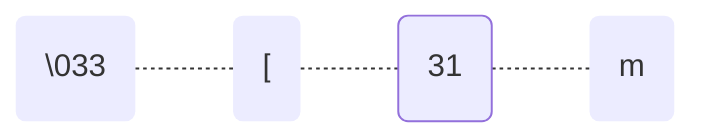

# :material-palette-outline:{ .lg .middle } Style

<div class="pfg-section" markdown="block">

Code that works isn't automatically code that's easy to read and maintain.

- **Consistent:** following the same conventions reads the same, no matter who wrote it
- **Faster to learn:** a new file feels familiar, uses the same patterns 
- **Easier to debug:** you know where to look when something breaks
- **Effective collaboration:** when your code is **reviewed** so it can be **merged** in with everyone else's changes, consistent style means it's clearer what you actually changed, instead of needing to compare conflicting formatting choices

</div>

<div class="pfg-section" markdown="block">

## PEP 8 style guide

[**PEP 8** is Python's official style guide](https://peps.python.org/pep-0008/) — a document written by Python's own core developers covering formatting, naming, and organizing code. "PEP" stands for Python Enhancement Proposal.

Python runs styled and unstyled code identically, so following PEP 8 doesn't make a script more *correct* — it makes it more *predictable* to read. Anyone who's used Python before recognizes the shape of PEP 8-styled code, so sticking to it means less friction reading someone else's code, and less friction when someone else reads yours.

### File order { data-advanced="true" }

A Python file conventionally follows the same layout, top to bottom — a linter won't flag this on its own the way it does most of PEP 8, since it's a convention about where things go rather than a formatting rule.[^order-pep8]

1. **Module docstring** — what the file does
2. **[Imports](modules.md#importing-modules)** — standard library, then third-party, then local
3. **Constants** — `ALL_CAPS` values used throughout the file
4. **Functions and classes** — the file's actual logic
5. **[The `if __name__ == "__main__":` guard](modules.md#the-main-guard)** — the code that runs when the file is executed

[^order-pep8]: The first three steps are PEP 8. Where functions/classes and the main guard fall isn't PEP 8 — but it is the convention the rest of the Python community has settled on.

```python-ref
"""
snake_survey.py

Tracks species and lengths recorded during the spring snake survey.

Author: Jordan Lee
Date: 2024-03-15
"""

import csv

MAX_TYPICAL_LENGTH_FT = 5

def is_unusually_long(length_ft):
    """Check whether a snake is unusually long for its species."""
    return length_ft > MAX_TYPICAL_LENGTH_FT

class Snake:
    """A single snake recorded during the survey."""

    def __init__(self, species, length_ft):
        self.species = species
        self.length_ft = length_ft

if __name__ == "__main__":
    ball = Snake("ball python", 4.5)
    print(is_unusually_long(ball.length_ft))
```

### Naming

A variable name should say what it holds — `length_ft` over `l`, `species_list` over `data`. `snake_case` and the other naming rules are covered on the [Foundations](foundations.md#naming-variables) page; this is about picking a *meaningful* name within those rules, not just a valid one.

```python-ref
l = 4.5                # what is l?
length_ft = 4.5        # clear at a glance
```

A short name is fine when its scope is short too — `for s in species:` is common, since `s` only exists for the one line inside the loop.

### Constants { data-advanced="true" }

A **constant** is a variable whose value isn't meant to change while the program runs — written in `ALL_CAPS` by convention, so it's easy to tell apart from a regular variable at a glance. Defining one instead of repeating a raw number (a "magic number") gives that number a name explaining what it means.

```python-ref
if length_ft > 5:                    # what's special about 5?
    print("unusually long")

MAX_TYPICAL_LENGTH_FT = 5            # named once, explains itself
if length_ft > MAX_TYPICAL_LENGTH_FT:
    print("unusually long")
```

Constants are usually defined near the top of a file, so they're easy to find and adjust later — see [File Order](#file-order) above.

### Quote style { data-advanced="true" }

Python treats `'single'` and `"double"` quotes identically for strings — PEP 8 doesn't prefer one over the other, just pick one as your default and stick with it throughout a file, rather than mixing both without reason. (This site uses double quotes.) The one except&zwnj;ion: switch to the other quote character for a string that itself contains a quote, rather than escaping it with a backslash.

```python-ref
print("it's a ball python")    # no backslash needed
print('it\'s a ball python')   # works, but harder to read
```

### Docstrings

A triple-quoted string as the first line of a function or a file documents what it does — the underlying trick is the same [multi-line comment](foundations.md#multi-line-comments-with) covered on Foundations, just placed specifically as the first line.

```python-ref
def is_unusually_long(length_ft):
    """Check whether a snake is unusually long for its species."""
    return length_ft > 5
```

For a function whose parameters or return value need explaining, spell them out with a standard `Args`/`Returns` format instead of a one-line summary:

```python-ref
def is_unusually_long(species, length_ft):
    """
    Check whether a snake is unusually long for its species.

    Args:
        species (str): the snake's species name.
        length_ft (float): the snake's measured length, in feet.

    Returns:
        bool: True if length_ft is unusually long for species.
    """
    return length_ft > 5
```

Full rules on the [Functions](functions.md#docstrings) page.

Placed as the very first line of a file instead, the same trick becomes a **module docstring** — documenting the file as a whole rather than a single function, and a common place to note who wrote it and when.

```python-ref
"""
snake_survey.py

Tracks species and lengths recorded during the spring snake survey.

Author: Jordan Lee
Date: 2024-03-15
"""

species = "ball python"
length_ft = 4.5
```

### Indentation { data-advanced="true" }

Python uses indentation, not braces, to mark a block — PEP 8's rule is 4 spaces per level, never tabs (mixing the two causes real errors, not just style complaints).

```python-ref
def describe(species):
  return f"a {species} python"      # 2 spaces — works, but not PEP 8

def describe(species):
    return f"a {species} python"    # 4 spaces — PEP 8
```

### Blank lines

Two blank lines separate top-level function and class definitions; one blank line separates methods inside a class.

```python-ref
def parse_entry(text):
    ...
def save_entry(entry):    # only one blank line — not PEP 8
    ...


def parse_entry(text):
    ...


def save_entry(entry):    # two blank lines — PEP 8
    ...
```

### Whitespace

Put a single space around most operators (`=`, `==`, `+`, `>`), but drop it around `=` when it's a keyword argument rather than an assignment.

```python-ref
length_ft=4.5                              # missing spaces — not PEP 8
length_ft = 4.5                            # PEP 8

def describe(species, length_ft = 4.5):    # spaces around a keyword default — not PEP 8
    ...

def describe(species, length_ft=4.5):      # PEP 8
    ...
```

### Comments { data-advanced="true" }

An inline comment needs at least two spaces before the `#` and one space after it; a block comment on its own line follows the same one-space-after rule.

```python-ref
length_ft = 4.5 #too short         # not PEP 8 — no spacing
length_ft = 4.5  # too short       # PEP 8 — two spaces before, one after

#check length                      # not PEP 8
# check length                     # PEP 8
```

</div>

<div class="pfg-section" markdown="block">

## Linters and formatters

A **linter** is a tool that scans your code and flags issues like [PEP 8](#pep-8-style-guide), Python's official style guide, and [Pythonic](#pythonic-patterns) idioms automatically. It reads your file, checks it against its rule set, and prints a report: one line per violation, giving the file, line number, a rule code, and a short message. 

It can't catch a bug that only shows up when the code actually runs, since it never runs it. 

A **formatter** tool (either separate, or a combined linter+formatter), actually rewrites your file on its own fixing the errors. However, it can be helpful to manually fix the issues on your own, so you learn to write them correctly for next time.  

**Comparing different tools**

| Tool | Type | Best for |
|------|------|----------|
| PyCharm's built-in inspections | Linter | No setup needed — catches most PEP 8 violations and several Pythonic issues automatically |
| Pylint | Linter | Comprehensive checks — catches complex logical errors, not just formatting |
| Ruff | Linter & Formatter | Speed — large projects or CI pipelines where Pylint's speed becomes noticeable |
| Black | Formatter | Eliminating style debates entirely — rewrites the file to a consistent style automatically, instead of just flagging issues |

**Get started in your environment**

| Environment | Installing third party tools | Using a linter | Using a formatter |
|-------------|-----------------------------------|-----------------|--------------------|
| PyCharm | `Settings > Plugins >` tool name, then restart | Built-in inspections run automatically, no setup needed; plugins do too, once installed. Underlines issues, hover for full message. Full issue list in `View > Tool Windows > Problems`. | `Code > Format Code` |
| VS Code | `View > Extensions >` tool name | Underlines issues, hover for full message. Full issue list in `View > Problems`. | Trigger via `Format Document`, or set it as the default formatter in `settings.json` |
| Outside of an IDE | Send in terminal: `pip install` [tool name] | print report in the terminal:<ul><li>`pylint your_file.py`</li><li>`ruff check your_file.py`</li></ul> | rewrite the file directly:<ul><li>`black your_file.py`</li><li>`ruff format your_file.py`</li></ul>|

</div>

<div class="pfg-section" markdown="block">

## Pythonic patterns

**Pythonic** code uses Python's own built-in features and standard patterns, instead of verbose work arounds. 

There's no single tool that reliably flags all "unpythonic" code the way PEP 8 has a document to check against. The real habit is asking *"does Python already have a built-in way to do this?"* before writing a manual loop, counter, or flag — an instinct built over time to recognize the built-in pattern.

Other programming languages have different features and patterns, so if code is translated from another language into Python it might not be written very clearly. Pythonic code tends to be less buggy.
A few of these a beginner tends to write out longhand before learning the built-in shortcut, roughly most to least common:

### Mutable default arguments

A default argument's value is created once, when the function is defined — not fresh on every call. A mutable default like a list or dict is quietly reused and built up across every call that doesn't pass its own, instead of starting empty each time.

```python-ref
def add_sighting(species, log=[]):     # the same list, reused on every call
    log.append(species)
    return log

def add_sighting(species, log=None):   # Pythonic — a fresh list every call
    log = [] if log is None else log
    log.append(species)
    return log
```

### Truthy checks instead of len(x) > 0 { #truthy-checks data-advanced="true" }

Test a collection directly — a non-empty list is already truthy.

```python-ref
if len(species) > 0:    # works, but not Pythonic
    print("found some")

if species:              # Pythonic — a non-empty list is already truthy
    print("found some")
```

### enumerate() instead of range(len(...)) { #enumerate-instead-of-range data-advanced="true" }

Loop with both the index and the item at once, instead of indexing into the list by hand.

```python-ref
for i in range(len(species)):        # manual indexing
    print(i, species[i])

for i, s in enumerate(species):      # Pythonic — enumerate() hands back both
    print(i, s)
```

### is None instead of == None { #is-none-instead-of-none }

Checking against `None` is a check of identity, not equality, so `is` is the correct tool — `==` usually happens to work too, but a class can override what `==` means, which makes this a real correctness risk and not just a style nit.

```python-ref
length_ft = None
if length_ft == None:                # works, but not Pythonic
    print("unknown length")

if length_ft is None:                # Pythonic — `is` is the correct tool for a None check
    print("unknown length")
```

</div>

<div class="pfg-section" markdown="block">

## Efficiency { data-advanced="true" }

Correct code produces the right output. 

Efficient code does it **without spending more resources than the problem needs**, which becomes a significant issue once your number of variables or calculations start increasing to the thousands and beyond.

### Time and space { data-card-link="skip" }

These are two **computational resources** to weigh while designing a program — not the only ones that exist, but the two that show up most in everyday Python code.

| | Time | Space |
|---|---|---|
| **Definition** | Steps an operation takes. A faster computer still runs the same code quicker. | Extra memory an operation needs, beyond the input itself. |
| **You might not notice this on a small script because...** | Modern hardware can still run it fast enough not to notice. | The items can still easily fit in memory. |
| **Starts becoming an issue at scale because...** | A test list of 10 behaves nothing like a real dataset of 100,000, if the operation grows quadratically instead of linearly. | Holding several full copies of a 100,000-record dataset can exceed available memory. |
| **Risk if ignored** | Slows down or stops responding — and can cost $, since servers bill for processing time used. | Runs out of memory and crashes — and can cost $, since servers bill for memory used. |

#### Big O notation 

Representing **O**rder of growth, the standard way to describe *how time and space grow*:

- <span class="pt-bigo pt-bigo--good">O(1)</span> constant -> doesn't grow with n — the same extra space or steps no matter the input size
- <span class="pt-bigo pt-bigo--ok">O(n)</span> or <span class="pt-bigo pt-bigo--ok">O(log n)</span> or <span class="pt-bigo pt-bigo--ok">O(n log n)</span> -> grows but stays manageable — double the input, and an O(n) operation takes about twice as long
- <span class="pt-bigo pt-bigo--bad">O(n²)</span> or worse -> grows fast enough to become a bottleneck once n is large — double the input, and it takes four times as long

#### Other considerations

- **Constant factor** — has the same growth rate, but each individual step actually costs less time or memory to run — like two people crossing a room in the same number of steps, just one takes bigger, faster steps than the other.
- **Redundant work** — doing something twice that once would cover.
- **Amortized cost** — a single call is occasionally expensive (list `append()` resizing its underlying storage, say), but averaged across every call it makes over time, the cost still comes out cheap.


### Common optimizations { data-card-link="skip" }

| While using | Instead of | **do this** | Because of |
|---|---|---|---|
| [Strings](types.md#combine) | `+=` in a loop<br /><span class="pt-bigo pt-bigo--bad">O(n²)</span> | `.join()`<br /><span class="pt-bigo pt-bigo--ok">O(n)</span> | Big O |
| [Lists](collections.md#create) | `result = result + [item]` in a loop<br /><span class="pt-bigo pt-bigo--bad">O(n²)</span> | `result.append(item)`<br /><span class="pt-bigo pt-bigo--ok">O(n)</span> | Big O |
| [Lists](collections.md#inspect) | Counting items in a loop<br /><span class="pt-bigo pt-bigo--ok">O(n)</span> | `len()`<br /><span class="pt-bigo pt-bigo--good">O(1)</span> | Big O |
| [Dictionaries](collections.md#dictionaries) | Checking `in` then indexing (two lookups)<br /><span class="pt-bigo pt-bigo--good">O(1)</span> | `.get()` (one lookup)<br /><span class="pt-bigo pt-bigo--good">O(1)</span> | Redundant work |
| [Sets](collections.md#sets) | `in` on a list or tuple<br /><span class="pt-bigo pt-bigo--ok">O(n)</span> | `in` on a set or dict<br /><span class="pt-bigo pt-bigo--good">O(1)</span> average | Big O |
| [Lists](collections.md#lists) | `sorted()`, when the original doesn't need to survive<br /><span class="pt-bigo pt-bigo--ok">O(n)</span> space | `sort()`<br /><span class="pt-bigo pt-bigo--good">O(1)</span> space | Big O |
| [Sets](collections.md#sets) | Checking every item against every other item for a duplicate, a loop nested inside another loop<br /><span class="pt-bigo pt-bigo--bad">O(n²)</span> | Converting to a set to check for duplicates<br /><span class="pt-bigo pt-bigo--ok">O(n)</span> | Big O |
| [Dictionaries](collections.md#dictionaries) | A list of `(key, value)` tuples, searched by hand<br /><span class="pt-bigo pt-bigo--ok">O(n)</span> | A dict<br /><span class="pt-bigo pt-bigo--good">O(1)</span> | Big O |
| [Lists](collections.md#lists) | `insert(0, x)` / `pop(0)`<br /><span class="pt-bigo pt-bigo--ok">O(n)</span> | `append()` / `pop()` (or `deque` for the front)<br /><span class="pt-bigo pt-bigo--good">O(1)</span> | Amortized |
| [By line](files.md#by-line) | `.read()` / `.readlines()` on a large file<br /><span class="pt-bigo pt-bigo--ok">O(n)</span> space | A loop, line by line<br /><span class="pt-bigo pt-bigo--good">O(1)</span> space | Big O |
| [Recursion](functions.md#recursion) | Deep recursion<br /><span class="pt-bigo pt-bigo--ok">O(n)</span> space | A loop<br /><span class="pt-bigo pt-bigo--good">O(1)</span> space | Big O |
| [Array operations](libraries/numpy.md#array-operations) | A Python loop over an array<br /><span class="pt-bigo pt-bigo--ok">O(n)</span> | A vectorized NumPy operation, smaller constant<br /><span class="pt-bigo pt-bigo--ok">O(n)</span> | Constant factor |
| [Searching for a pattern](libraries/re.md#searching-for-a-pattern) | Recompiling a regex pattern every pass<br /><span class="pt-bigo pt-bigo--ok">O(n)</span> | `re.compile()` once, reused<br /><span class="pt-bigo pt-bigo--good">O(1)</span> | Redundant work |
| [try/except](errors.md#catch-with-tryexcept) | Checking first, when failure is rare<br /><span class="pt-bigo pt-bigo--good">O(1)</span> | `try`/`except`, cheaper when it succeeds<br /><span class="pt-bigo pt-bigo--good">O(1)</span> | Constant factor |
| [Instance attributes](classes.md#instance-attributes) | Many plain instances<br /><span class="pt-bigo pt-bigo--ok">O(n)</span> memory | `__slots__`, smaller constant<br /><span class="pt-bigo pt-bigo--ok">O(n)</span> memory | Constant factor |

</div>

<div class="pfg-section" markdown="block">

## Polished UX

**UX** (user experience) is how a program interacts with the person running it and engages with them — including what it asks, how it reacts to their answer, and how it recovers when they get something wrong.

### Input validation

An `input()` is only as reliable as what it assumes the user will type. Validating means re-asking on a bad or missing answer, instead of letting the program crash or continue on with garbage input.

#### Wrong choice

The below `while` loop keeps re-asking until the input is one of the allowed options:

```python-ref
choice = input("> ")
while choice not in ("1", "2"):
    print("Please enter 1 or 2.")
    choice = input("> ")
```

#### Wrong type

`input()` always returns a string, so when working with numbers it must be converted with `int()` or `float()`. However, this raises a `ValueError` if the user didn't type a number. Wrapping the conversion in [`try`/`except`](errors.md#catch-specific-exceptions) and re-asking on failure guards against input that's the wrong type.

```python-ref
age = input("How old is this snake, in years? ")

while True:
    try:
        age = int(age)
        break
    except ValueError:
        age = input("Please enter a whole number: ")

print(f"That's about {age * 7} in human years.")
```

Using a [string validate method](types.md#validate) is another other way to catch this — checking the string *before* converting it, instead of attempting the conversion and catching the failure after:

```python-ref
species = input("Enter a species name: ")

while not species.isalpha():
    species = input("Letters only, try again: ")

print(f"Logged: {species}")
```

#### Confirm input

Echoing the typed value back is a quick way to show it was read correctly, before doing anything else with it.

```python-ref
species = input("Enter a species: ")
print(f"\nScanning... {species} detected.")
```

### Menus

Let the user pick from a short list of options with `input()` and [`match`/`case`](conditionals.md#match-case) — a clear list of options to choose from, instead of leaving them to guess what to type.

#### Simple input

A menu is easiest to validate when each option is a single number or letter instead of free
text — there's only a handful of possible answers to check against, as in every example below.
Save the deeper validation for input that has to be open-ended, like a species name or a
measurement — and even there, don't assume the user typed it in the exact case or format
expected. Normalize the answer first with [`.strip()`](types.md#modify), `.lower()`, or
`.title()`, instead of rejecting anything that doesn't match exactly.

#### Single choice

The options are printed first, so the input prompt doesn't need to repeat them — a bare `"> "` on it's own line is sometimes easier to see.

```python-ref
print("You find a mysterious burmese python coiled in the grass.")
print("1. Approach it")
print("2. Back away slowly")

choice = input("> ")
match choice:
    case "1":
        print("It doesn't move. Burmese pythons are famously calm.")
    case _:
        print("You wisely continue on the trail.")
```

```bash
You find a mysterious burmese python coiled in the grass.
1. Approach it
2. Back away slowly
> 1
It doesn't move. Burmese pythons are famously calm.
```

This choice isn't checked against anything — typing `3` still falls into the `case _:` default. Combine it with [input validation](#input-validation) above to re-ask until the user answers `1` or `2`.

#### Continuous menu

Wrap the same pattern in a `while` loop that reprints the menu and `break`s once the user's done, to keep offering choices instead of asking just once.

```python-ref
while True:
    print("1. Log a sighting")
    print("2. Look up a species")
    print("3. Quit")

    choice = input("> ")
    match choice:
        case "1":
            print("Sighting logged.")
        case "2":
            print("Which species?")
        case "3":
            print("Goodbye!")
            break
```

#### Confirm quit

A quick confirmation before actually quitting keeps one wrong keypress from ending the whole program — ask a follow-up question inside the quit case, and only `break` once the answer is yes.

```python-ref
print("C. Continue")
print("Q. Quit")

choice = input("> ")
match choice:
    case "C":
        print("Continuing....")
    case "Q":
        confirm = input("Are you sure? (y/n) ") # add a second input as confirmation
        if confirm.strip().lower() == "y":
            print("Goodbye!")
```

Comparing with [`.strip()`](types.md#modify) and `.lower()` means `"Y"`, `" y"`, and `"y"` all count as the same answer, instead of only an exact match.

#### Robust menu

Combine all three: keep the menu [continuous](#continuous-menu), [confirm](#confirm-quit) before actually quitting, and [validate](#input-validation) the choice — since the whole thing already sits inside `while True:`, a `case _:` can print an error and let the loop reprint the menu and ask again, instead of needing a second retry loop.

```python-ref
while True:
    print("1. Log a sighting")
    print("2. Look up a species")
    print("3. Quit")

    choice = input("> ")
    match choice:
        case "1":
            print("Sighting logged.")
        case "2":
            print("Which species?")
        case "3":
            confirm = input("Are you sure? (y/n) ")
            if confirm.strip().lower() == "y":
                print("Goodbye!")
                break
        case _:
            print("Please enter 1, 2, or 3.")
```

See [Boxes](#boxes) below to wrap the same three options in a decorative border instead of a plain list.

### Randomize messages

[`random.choice()`](libraries/random.md) picks one item from a list at random, so it prints different messages every run.

```python
import random

responses = [
    "you got this!",
    "excellent choice.",
    "the python spirits approve.",
    "interesting...",
    "bold.",
]
print(random.choice(responses))
```

Combined with `input()` and a conditional, the same idea lets a program react differently depending on what it's told, rather than just calculating and printing a result.

```python-ref
import random

name = input("What's your name? ")

if name.strip().lower() == "python":
    print("...you already know who I am.")
else:
    responses = [
        "nice to meet you!",
        "welcome to the field guide!",
        "excellent name.",
    ]
    print(random.choice(responses))
```

</div>

<div class="pfg-section" markdown="block">

## Polished UI

**UI** (user interface) is how a program presents itself to the person running it. Just like an app or website, the terminal is an interface that can be designed within its limitations to create a more engaging and intuitive user experience.  

### Escape sequences

An **escape sequence** is a backslash followed by a letter, standing in for a character that couldn't otherwise appear in the string — used instead of typing the literal character (an actual tab, an actual line break) directly into the source.

| Escape | Prints |
|---|---|
| `\n` | a new line |
| `\t` | a tab, as in lining up columns of output |
| `\"`, `\'` | a literal quote character |
| `\\` | a literal backslash | 
| `\r` | returns the cursor to the start of the line, as in a [progress bar](#progress-bars)|

```python
species = "ball python"
length_ft = 4.5

print(f"Species:\t{species}\nLength ft:\t{length_ft}")
```

### Multi-line strings

Here are three ways to print the same four-line string:

- Multiple single quote `print("")` statements, they have an implicit `\n` at the end that puts each on a new line

    ```python
    print("")
    print("empty line above!")
    print("and below...")
    print("")
    ```

- Escape character `\n` adds a new line

    ```python
    print("\nempty line above!\nand below...\n")
    ```

- A triple-quoted string `print("""...""")` prints with every line break inside the quotes as typed

    ```python
    print("""
    empty line above!
    and below...
    """)
    ```

For anything longer than a line or two, the triple-quoted string is easiest to read and change later — it holds the whole layout in one block, instead of assembling it across several separate `print()` calls.

### Formatting variables

F-strings and format specs assemble a formatted string directly, instead of building it up by hand with `+` and manual padding. An [f-string](types.md#building-strings) — a variable's name dropped directly inside `{}` — is what turns the dashboard's bare `snake` dict into a filled-in box. A [format spec](types.md#building-strings) inside that same `{}` controls how the value looks, built from these pieces in order:

1. fill (padding character)
2. align (left, right, center, or pad between a sign and its digits)
3. sign (`-`, `+`, or space)
4. `0` (zero-pad shorthand)
5. width (minimum characters)
6. thousand separator (comma grouping)
7. precision (decimal digits)
8. type (`d`, `f`, `%`)

An f-string can turn plain variables into a **dashboard**:

```python
snake = {"species": "ball python", "length_ft": 4.5, "venomous": False}

print(f"""
┌─────────────────────────────┐
│        SNAKE RECORD         │
├─────────────────────────────┤
│ Species    {snake["species"]:<17}│
│ Length ft  {snake["length_ft"]:<17}│
│ Venomous   {str(snake["venomous"]):<17}│
└─────────────────────────────┘
""")
```

### Unicode symbols

Box-drawing characters, arrows, and checkmarks give output visual structure that plain ASCII can't — swapped in wherever a border, pointer, or status icon would otherwise just be a `-`, `>`, or `x`.

#### Original ASCII

**ASCII** was the original 128 character encoding for computers, standardized in the 1960s — covering English letters, digits, and punctuation on a standard keyboard. Early console styling was built around using these characters to make **ascii text and art**. 

Building a [raw string](types.md#building-strings) with an `r` prefix (`r"""..."""`) makes this possible to print - so that Python doesn't mistake the backslashes `\` for meaningful escape characters.

There are online tools to [convert text to ascii fonts](https://patorjk.com/software/taag/#p=display&f=Isometric1&t=Type+Something+&x=none&v=4&h=4&w=80&we=false) and [find ascii art](https://www.asciiart.eu/#google_vignette).

```python
print(r"""
 ____  _  _  ____  _   _  _____  _  _ 
(  _ \( \/ )(_  _)( )_( )(  _  )( \( )
 )___/ \  /   )(   ) _ (  )(_)(  )  ( 
(__)   (__)  (__) (_) (_)(_____)(_)\_)
""")
```

#### Unicode expansion

**Unicode** started in 1991 and expanded on ASCII with a larger growing set: it started with the same 128 characters ASCII already had, and is now at 150,000 characters. Because it keeps growing, something built before a character existed may show a blank box or `?`. Python 3 uses UTF-8 to encode its characters, so you can include Unicode characters directly in your Python files. However, your editor or terminal may still lack a font that can display a particular character.

Emoji are part of this too: the character itself (🦖) is a Unicode character, but the specific picture a device displays is drawn by each platform, which is why the same emoji looks different on iPhone vs. Android.

Copy and paste these Unicode characters into your print statements, or [Browse the full set](https://unicode-table.com/en/):

=== "Box-drawing"

    `┌` `─` `┐` `│` `├` `┤` `└` `┘` `┬` `┴` `┼` `╵` `╶` `╷` `╴`

    `╔` `═` `╗` `║` `╠` `╣` `╚` `╝` `╦` `╩` `╬` `╟` `╤` `╢` `╧`

    `╭` `╮` `╰` `╯`

=== "Progress bars"

    `█` `▓` `▒` `░`

    `⠋` `⠙` `⠹` `⠸` `⠼` `⠴` `⠦` `⠧` `⠇` `⠏`

    `↺` `↻` `⟲` `⟳`

=== "Arrows"

     `→` `➔` `➜` `←` `↑` `↓`

    `▶` `◀` `➤` `»` `›` `❯` `❮` `❱` `❰` 
    
    `↳` `↲` `↰` `↱` `↵` `↴` `↪` `↩` 
    
    `⮕` `⬅` `⬆` `⬇`

=== "Checks and crosses"

    `✓` `✔` `☑` `✅` 
    
    `✖` `✗` `✘` `☒` `𐄂` `❌` `❎` 

=== "Bullets"

    `•` `∙` `◉` `○` `◌` `◎` `●` `◦` `。` `☉` `⦾` `⦿`  
    
    `◆` `◇` `◈` `♦` `⋄` `✦` `✧`
    
    `☸` `✱` `✲` `✳`
    
    `■` `□` `☐` `▪` 
    
    `🔵` `🟢` `🟠` `🔴` `⚫` `🟤` `🟣` `⛔`

=== "Special"

    `☺` `★` `☆` `©` `®` `™` `❤` `♡` `♥`

### Dividers

A row of repeated characters separates sections of output.

```python
print("survey results")
print("=" * 40)
```

### Boxes

Combine the [box-drawing unicode symbols](#unicode-symbols) to emphasize output, these were designed for early programs.

```python
print("""
╭──────────────────────────────────────────╮
│       WELCOME TO THE THE FIELD GUIDE™    │
╰──────────────────────────────────────────╯

╔═══════════════════════╗
║  MENU                 ║
╟───────────────────────╢
║  1. Log a sighting    ║
║  2. Look up a species ║
║  3. ✖ Quit            ║
╚═══════════════════════╝

❱ _
""")  
```

### Progress bars

A pause with no output looks like the program has frozen — printing something that visibly changes during the wait shows it's still working, instead of leaving the screen silent. `time.sleep()` from the [time library](modules.md#import) pauses a program for a set number of seconds. Called in a loop between `print()` calls with [`end=""`](types.md#combine) to keep the cursor on the same line, it fakes a "loading" delay.

```python-ref
import time

print("Loading", end="")
for _ in range(3):
    time.sleep(0.5)
    print(".", end="")
print(" done!")
```

`end=""` never starts a new line, so this grows one dot at a time on the same line, half a second apart:

```bash
Loading
Loading.
Loading..
Loading...
Loading... done!
```

Print with [`end="\r"`](types.md#combine) instead, and each update returns the cursor to the beginning of the same line, allowing the next output to overwrite the previous one and build an animated progress bar out of characters.

```python-ref
import time

for i in range(10):
    print("█" * i + "░" * (9 - i), end="\r")
    time.sleep(0.1)
print("█" * 10)
```

```bash
░░░░░░░░░
█░░░░░░░░
██░░░░░░░
███░░░░░░
████░░░░░
█████░░░░
██████░░░
███████░░
████████░
█████████
```

A fixed list of characters, indexed with `i % len(spinner)` so it wraps back to the start instead of running out, animates the same way — a spinner instead of a bar.

```python-ref
import time

spinner = "⠋⠙⠹⠸⠼⠴⠦⠧⠇⠏"
for i in range(20):
    print(spinner[i % len(spinner)], end="\r")
    time.sleep(0.1)
print("done!")
```

```bash
⠏ 
```
The above character changes in place, so you see an animation cycling through the steps.

### Color styling

Terminal text that has **color**, **bold**, **underlines**, and a **background color** can be styled by printing escape sequences around the string you would like to style, instead of leaving it plain — an ANSI code before it, and a reset code after so the styling doesn't leak into whatever prints next.

#### Escape sequence structure

<div class="pfg-diagram-frame" markdown="block">



<p class="pfg-diagram-caption">FIG: ANSI color escape sequence, with code 31 for styling red text</p>

</div>

`\033` is the ESC character, `[` opens the code, then the code(s), and `m` closes it. 

#### Styling codes

**Color**, **background color**, **bold**, and **underlines**, are styled with these codes *(terminal's theme palette controls how each color will appear)*:

| Style Description | Code for text | Code for background |
|---|---|---|
| <span style="display:inline-block;width:1em;height:1em;background:#000000;border:1px solid #888;border-radius:2px;vertical-align:middle;margin-right:0.4em;"></span> Black color | `30` | `40` |
| <span style="display:inline-block;width:1em;height:1em;background:#808080;border:1px solid #888;border-radius:2px;vertical-align:middle;margin-right:0.4em;"></span> Bright black color | `90` | `100` |
| <span style="display:inline-block;width:1em;height:1em;background:#C91B00;border:1px solid #888;border-radius:2px;vertical-align:middle;margin-right:0.4em;"></span> Red color | `31` | `41` |
| <span style="display:inline-block;width:1em;height:1em;background:#FF0000;border:1px solid #888;border-radius:2px;vertical-align:middle;margin-right:0.4em;"></span> Bright red color | `91` | `101` |
| <span style="display:inline-block;width:1em;height:1em;background:#00C200;border:1px solid #888;border-radius:2px;vertical-align:middle;margin-right:0.4em;"></span> Green color | `32` | `42` |
| <span style="display:inline-block;width:1em;height:1em;background:#00FF00;border:1px solid #888;border-radius:2px;vertical-align:middle;margin-right:0.4em;"></span> Bright green color | `92` | `102` |
| <span style="display:inline-block;width:1em;height:1em;background:#C7C400;border:1px solid #888;border-radius:2px;vertical-align:middle;margin-right:0.4em;"></span> Yellow color | `33` | `43` |
| <span style="display:inline-block;width:1em;height:1em;background:#FFFF00;border:1px solid #888;border-radius:2px;vertical-align:middle;margin-right:0.4em;"></span> Bright yellow color | `93` | `103` |
| <span style="display:inline-block;width:1em;height:1em;background:#0225C7;border:1px solid #888;border-radius:2px;vertical-align:middle;margin-right:0.4em;"></span> Blue color | `34` | `44` |
| <span style="display:inline-block;width:1em;height:1em;background:#0000FF;border:1px solid #888;border-radius:2px;vertical-align:middle;margin-right:0.4em;"></span> Bright blue color | `94` | `104` |
| <span style="display:inline-block;width:1em;height:1em;background:#C930C7;border:1px solid #888;border-radius:2px;vertical-align:middle;margin-right:0.4em;"></span> Magenta color | `35` | `45` |
| <span style="display:inline-block;width:1em;height:1em;background:#FF00FF;border:1px solid #888;border-radius:2px;vertical-align:middle;margin-right:0.4em;"></span> Bright magenta color | `95` | `105` |
| <span style="display:inline-block;width:1em;height:1em;background:#00C5C7;border:1px solid #888;border-radius:2px;vertical-align:middle;margin-right:0.4em;"></span> Cyan color | `36` | `46` |
| <span style="display:inline-block;width:1em;height:1em;background:#00FFFF;border:1px solid #888;border-radius:2px;vertical-align:middle;margin-right:0.4em;"></span> Bright cyan color | `96` | `106` |
| <span style="display:inline-block;width:1em;height:1em;background:#C7C7C7;border:1px solid #888;border-radius:2px;vertical-align:middle;margin-right:0.4em;"></span> White color | `37` | `47` |
| <span style="display:inline-block;width:1em;height:1em;background:#FFFFFF;border:1px solid #888;border-radius:2px;vertical-align:middle;margin-right:0.4em;"></span> Bright white color | `97` | `107` |
| **Bold text** | `1` | |
| <u>Underlined text</u> | `4` | |

**To end formatted string:** use reset code `0`(so full escape sequence is`\033[0m`).

| Reset all styles | Code |
|---|--|
| **Reset** | `0` |

#### Examples

- One escape code:

    *(see it between "[" and "m")*

    ```python-ref
    print("\033[31mThis is red text\033[0m")
    print("\033[32mThis is green text\033[0m")
    print("\033[1mThis is bold\033[0m")
    print("\033[4mThis is underlined\033[0m")
    print("\033[43mThis has a yellow background\033[0m")
    print("\033[91mThis is bright red\033[0m")
    ```

- Multiple codes separated with `;` : 

    *Combine codes inside the same escape sequence. Can't have two of the same category - e.g. no two text colors or two background colors.*

    ```python-ref
    print("\033[31;43mThis is red text with a yellow background\033[0m")
    print("\033[1;32mThis is green text that is bold\033[0m")
    ```

- Across multiple lines: 

    *The styling stays active across multiple `print()` calls, until the reset code occurs.*

    ```python-ref
    print("\033[31mFirst red line")
    print("Second red line")
    print("\033[0m")
    ```

#### Compatibility

This requires a [terminal](workspace.md#using-the-terminal), either a stand-alone application or inside of an IDE, support varies by which one:

=== "macOS Terminal"

    Yes — Terminal.app, the default on macOS, supports ANSI color natively, as does iTerm2 and other third-party Mac terminals.

=== "Windows Terminal"

    Yes — Windows Terminal, the default on Windows 11, supports ANSI color natively. The older `cmd.exe` needs `colorama`, or Windows 10's Virtual Terminal Processing turned on first.

=== "Linux Terminal"

    Yes — virtually every Linux terminal emulator (GNOME Terminal, Konsole, xterm, and others) supports ANSI color natively.

=== "Visual Studio Code"

    Yes — runs through the Integrated Terminal, a real terminal emulator.

=== "PyCharm Community"

    Yes — both the Run console and the Terminal tool window support it.

=== "IDLE"

    No — its Shell window isn't a terminal emulator, so escape codes print as raw text instead of color.

=== "Thonny"

    No — same limitation as IDLE, its Shell window isn't a terminal emulator either.

</div>
